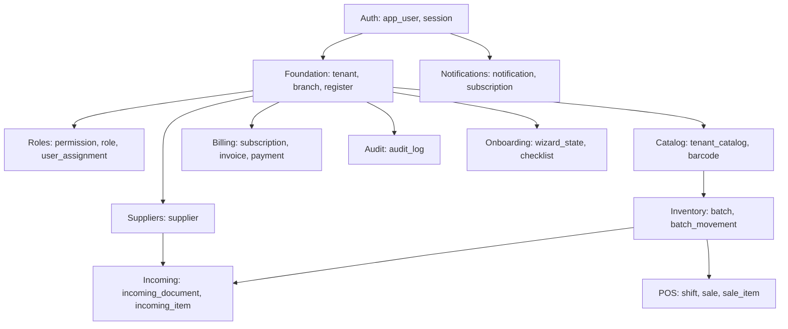

# Aurum Pharma — Схема БД v2

> **Версия:** 2.1
> **Дата:** июль 2026
> **Текущий Alembic head:** `0060`
> **Статус:** актуальная, для Этапа 1
> **СУБД:** PostgreSQL 16
> **Заменяет:** v1 схему (~80 таблиц)

---

## 0. Содержание

1. [Конвенции](#1-конвенции)
2. [Расширения и базовые функции](#2-расширения-и-базовые-функции)
3. [Обзор доменов](#3-обзор-доменов)
4. [Migration 0001 — extensions](#4-migration-0001--extensions)
5. [Migration 0002 — auth](#5-migration-0002--auth)
6. [Migration 0003 — foundation](#6-migration-0003--foundation)
7. [Migration 0004 — roles](#7-migration-0004--roles)
8. [Migration 0005 — catalog](#8-migration-0005--catalog)
9. [Migration 0006 — inventory](#9-migration-0006--inventory)
10. [Migration 0007 — suppliers/incoming](#10-migration-0007--suppliersincoming)
11. [Migration 0008 — POS](#11-migration-0008--pos)
12. [Migration 0009 — billing](#12-migration-0009--billing)
13. [Migration 0010 — audit](#13-migration-0010--audit)
14. [Migration 0011 — onboarding](#14-migration-0011--onboarding)
15. [Migration 0012 — notifications](#15-migration-0012--notifications)
16. [Представления (Views)](#16-представления-views)
17. [Индексы — сводка](#17-индексы--сводка)
18. [Партиционирование](#18-партиционирование)
19. [Сводка по таблицам](#19-сводка-по-таблицам)

---

## 1. Конвенции

| Аспект | Решение |
|---|---|
| Язык имён | `snake_case`, английский |
| PK | `id UUID PRIMARY KEY DEFAULT gen_random_uuid()` |
| FK | `<entity>_id` |
| Время | `TIMESTAMPTZ` в UTC всегда |
| Аудит-поля | `created_at`, `updated_at`, `created_by`, `updated_by` на тенантных |
| Soft delete | `deleted_at TIMESTAMPTZ NULL` — только на бизнес-критичных |
| JSONB | Для гибких данных, схема в Pydantic |
| RLS | На всех тенантных таблицах через `tenant_id = current_tenant_id()` |
| Денежные суммы | `NUMERIC(14, 2)` |
| Валюта | `currency TEXT NOT NULL DEFAULT 'TJS' CHECK (currency IN ('TJS'))` |
| Проценты | `NUMERIC(5, 2)` (0.00–999.99) |
| Зарезерв. слово `user` | Используем `app_user` |
| Идентификаторы | UUIDv4, без последовательных IDs (анти-enumeration) |

**Иммутабельность продаж:** `sale.status = 'completed'` — не редактируется. Enforce в `service.py`, не в БД-триггерах (нужны понятные ошибки клиенту).

---

## 2. Расширения и базовые функции

```sql
-- Расширения
CREATE EXTENSION IF NOT EXISTS "pgcrypto";    -- gen_random_uuid()
CREATE EXTENSION IF NOT EXISTS "pg_trgm";     -- trigram search для каталога
CREATE EXTENSION IF NOT EXISTS "unaccent";    -- поиск без диакритики

-- =============================================================================
-- Функции RLS-контекста
-- =============================================================================

-- Текущий tenant_id из GUC (устанавливается middleware)
CREATE OR REPLACE FUNCTION current_tenant_id() RETURNS UUID AS $$
DECLARE
  v TEXT;
BEGIN
  v := current_setting('app.tenant_id', true);
  IF v IS NULL OR v = '' THEN
    RETURN NULL;
  END IF;
  RETURN v::UUID;
EXCEPTION WHEN OTHERS THEN
  RETURN NULL;
END;
$$ LANGUAGE plpgsql STABLE;

-- Текущий user_id из GUC
CREATE OR REPLACE FUNCTION current_app_user_id() RETURNS UUID AS $$
DECLARE
  v TEXT;
BEGIN
  v := current_setting('app.user_id', true);
  IF v IS NULL OR v = '' THEN
    RETURN NULL;
  END IF;
  RETURN v::UUID;
EXCEPTION WHEN OTHERS THEN
  RETURN NULL;
END;
$$ LANGUAGE plpgsql STABLE;

-- Поддержка-сессия (BYPASSRLS)
CREATE OR REPLACE FUNCTION is_support_session() RETURNS BOOLEAN AS $$
BEGIN
  RETURN current_setting('app.support_session', true) = 'true';
EXCEPTION WHEN OTHERS THEN
  RETURN false;
END;
$$ LANGUAGE plpgsql STABLE;

-- =============================================================================
-- Триггер для updated_at + updated_by
-- =============================================================================
CREATE OR REPLACE FUNCTION trg_set_updated_meta() RETURNS TRIGGER AS $$
BEGIN
  NEW.updated_at := now();
  IF TG_OP = 'UPDATE' AND current_app_user_id() IS NOT NULL THEN
    NEW.updated_by := current_app_user_id();
  END IF;
  RETURN NEW;
END;
$$ LANGUAGE plpgsql;

-- =============================================================================
-- Триггер для created_at + created_by
-- =============================================================================
CREATE OR REPLACE FUNCTION trg_set_created_meta() RETURNS TRIGGER AS $$
BEGIN
  IF NEW.created_by IS NULL AND current_app_user_id() IS NOT NULL THEN
    NEW.created_by := current_app_user_id();
  END IF;
  RETURN NEW;
END;
$$ LANGUAGE plpgsql;

-- =============================================================================
-- Audit-log триггер (универсальный)
-- =============================================================================
CREATE OR REPLACE FUNCTION trg_audit_log() RETURNS TRIGGER AS $$
DECLARE
  v_tenant_id UUID;
  v_user_id UUID;
  v_old_data JSONB;
  v_new_data JSONB;
  v_changed_fields JSONB;
BEGIN
  v_tenant_id := COALESCE(
    CASE WHEN TG_OP = 'DELETE' THEN (OLD).tenant_id ELSE (NEW).tenant_id END,
    current_tenant_id()
  );
  v_user_id := current_app_user_id();

  IF TG_OP = 'INSERT' THEN
    v_old_data := NULL;
    v_new_data := to_jsonb(NEW);
  ELSIF TG_OP = 'UPDATE' THEN
    v_old_data := to_jsonb(OLD);
    v_new_data := to_jsonb(NEW);
    -- Только изменённые поля
    SELECT jsonb_object_agg(key, value) INTO v_changed_fields
    FROM jsonb_each(v_new_data) WHERE v_old_data->key IS DISTINCT FROM value;
    IF v_changed_fields IS NULL OR v_changed_fields = '{}'::jsonb THEN
      RETURN NEW;  -- ничего не изменилось — не логируем
    END IF;
  ELSE  -- DELETE
    v_old_data := to_jsonb(OLD);
    v_new_data := NULL;
  END IF;

  INSERT INTO audit_log (
    tenant_id, user_id, action, table_name, record_id,
    old_values, new_values, changed_fields, created_at
  ) VALUES (
    v_tenant_id, v_user_id, TG_OP::text, TG_TABLE_NAME::text,
    CASE WHEN TG_OP = 'DELETE' THEN (OLD).id ELSE (NEW).id END,
    v_old_data, v_new_data, v_changed_fields, now()
  );

  IF TG_OP = 'DELETE' THEN
    RETURN OLD;
  END IF;
  RETURN NEW;
END;
$$ LANGUAGE plpgsql;
```

---

## 3. Обзор доменов



**Иерархия зависимостей:**
1. `auth` (нет тенантов, но есть пользователи)
2. `foundation` (тенант, точка, касса — связывает auth с tenant)
3. Всё остальное — параллельно зависит от `foundation`

---

## 4. Migration 0001 — extensions

См. раздел 2. Это первая миграция, она создаёт расширения и все базовые функции. Триггеры на конкретных таблицах создаются в миграциях этих таблиц.

```python
# alembic/versions/0001_extensions_and_helpers.py
# Содержит весь SQL из раздела 2.
# downgrade() удаляет функции и расширения.
```

---

## 5. Migration 0002 — auth

Создаётся **до** foundation, потому что `app_user.id` нужен для `created_by`/`updated_by` foreign keys в foundation. Однако `app_user.home_tenant_id` ссылается на `tenant.id` (создаётся в 0003) — поэтому этот FK добавляется отложенно в 0003.

```sql
-- =============================================================================
-- APP_USER
-- =============================================================================
CREATE TABLE app_user (
  id                  UUID PRIMARY KEY DEFAULT gen_random_uuid(),
  email               TEXT NOT NULL,
  email_lower         TEXT GENERATED ALWAYS AS (lower(email)) STORED,
  full_name           TEXT NOT NULL,
  phone               TEXT,
  password_hash       TEXT,                   -- опциональный (для cash mode)
  is_developer        BOOLEAN NOT NULL DEFAULT false,
  is_administrator    BOOLEAN NOT NULL DEFAULT false,
  -- Привязка к "домашнему" тенанту (NULL для developer/administrator)
  home_tenant_id      UUID,                   -- FK добавляется в миграции 0003
  -- Жизненный цикл
  status              TEXT NOT NULL DEFAULT 'invited'
                        CHECK (status IN ('invited','active','blocked','archived')),
  invited_at          TIMESTAMPTZ NOT NULL DEFAULT now(),
  activated_at        TIMESTAMPTZ,
  blocked_at          TIMESTAMPTZ,
  archived_at         TIMESTAMPTZ,
  last_login_at       TIMESTAMPTZ,
  -- Метаданные
  created_at          TIMESTAMPTZ NOT NULL DEFAULT now(),
  updated_at          TIMESTAMPTZ NOT NULL DEFAULT now()
);
CREATE UNIQUE INDEX ux_app_user_email_lower ON app_user (email_lower);
CREATE INDEX ix_app_user_status ON app_user (status);
CREATE INDEX ix_app_user_home_tenant ON app_user (home_tenant_id) WHERE home_tenant_id IS NOT NULL;
CREATE TRIGGER trg_app_user_updated BEFORE UPDATE ON app_user
  FOR EACH ROW EXECUTE FUNCTION trg_set_updated_meta();

-- app_user НЕ имеет tenant_id (это таблица идентификаторов).
-- TOTP-секреты здесь запрещены: support-MFA хранится отдельно и зашифрованно.
-- Прямой доступ runtime-ролей закрыт; auth использует ограниченные
-- SECURITY DEFINER-функции.

-- =============================================================================
-- SESSION (refresh-токены)
-- =============================================================================
CREATE TABLE session (
  id                  UUID PRIMARY KEY DEFAULT gen_random_uuid(),
  user_id             UUID NOT NULL REFERENCES app_user(id) ON DELETE CASCADE,
  refresh_token_hash  TEXT NOT NULL,           -- sha256(refresh_token)
  device_id_hash      TEXT,                    -- sha256(HttpOnly device ID)
  user_agent          TEXT,
  ip_address          INET,
  created_at          TIMESTAMPTZ NOT NULL DEFAULT now(),
  last_used_at        TIMESTAMPTZ NOT NULL DEFAULT now(),
  expires_at          TIMESTAMPTZ NOT NULL,
  revoked_at          TIMESTAMPTZ,
  revoked_reason      TEXT,
  rotation_operation_id UUID,
  rotated_from_session_id UUID REFERENCES session(id) ON DELETE SET NULL,
  mfa_verified_at     TIMESTAMPTZ
);
CREATE INDEX ix_session_user ON session (user_id) WHERE revoked_at IS NULL;
CREATE UNIQUE INDEX ux_session_refresh_hash ON session (refresh_token_hash);
CREATE INDEX ix_session_expires ON session (expires_at) WHERE revoked_at IS NULL;
CREATE INDEX ix_session_user_device ON session (user_id, device_id_hash)
  WHERE device_id_hash IS NOT NULL;

-- session.mfa_verified_at хранит базовую MFA-проверку входа support-аккаунта.
-- Step-up не записывается в refresh-сессию: его время существует только в
-- короткоживущем access-токене, чтобы ранее украденный refresh-токен не мог
-- унаследовать повышенный уровень доверия.

-- =============================================================================
-- SUPPORT_MFA (только уровни 1–2)
-- =============================================================================
CREATE TABLE support_mfa (
  user_id                    UUID PRIMARY KEY
                              REFERENCES app_user(id) ON DELETE CASCADE,
  active_secret_ciphertext   BYTEA,
  pending_secret_ciphertext  BYTEA,
  active_key_version         SMALLINT
                              CHECK (active_key_version > 0),
  pending_key_version        SMALLINT
                              CHECK (pending_key_version > 0),
  status                     TEXT NOT NULL
                              CHECK (status IN (
                                'pending','active','recovery_pending'
                              )),
  active_generation          SMALLINT,
  pending_generation         SMALLINT,
  last_used_counter          BIGINT,
  confirmed_at               TIMESTAMPTZ,
  created_at                 TIMESTAMPTZ NOT NULL DEFAULT now(),
  updated_at                 TIMESTAMPTZ NOT NULL DEFAULT now(),
  CONSTRAINT ck_support_mfa_state_consistency CHECK (
    (
      status = 'active'
      AND active_secret_ciphertext IS NOT NULL
      AND active_key_version IS NOT NULL
      AND active_generation IS NOT NULL
      AND pending_secret_ciphertext IS NULL
      AND pending_key_version IS NULL
      AND pending_generation IS NULL
    )
    OR (
      status = 'pending'
      AND active_secret_ciphertext IS NULL
      AND active_key_version IS NULL
      AND active_generation IS NULL
      AND pending_secret_ciphertext IS NOT NULL
      AND pending_key_version IS NOT NULL
      AND pending_generation IS NOT NULL
    )
    OR (
      status = 'recovery_pending'
      AND active_secret_ciphertext IS NOT NULL
      AND active_key_version IS NOT NULL
      AND active_generation IS NOT NULL
      AND (
        (
          pending_secret_ciphertext IS NULL
          AND pending_key_version IS NULL
          AND pending_generation IS NULL
        )
        OR (
          pending_secret_ciphertext IS NOT NULL
          AND pending_key_version IS NOT NULL
          AND pending_generation IS NOT NULL
        )
      )
    )
  )
);

CREATE TABLE support_mfa_recovery_code (
  id                  UUID PRIMARY KEY DEFAULT gen_random_uuid(),
  user_id             UUID NOT NULL
                        REFERENCES support_mfa(user_id) ON DELETE CASCADE,
  generation          SMALLINT NOT NULL,
  code_hash           TEXT NOT NULL,
  created_at          TIMESTAMPTZ NOT NULL DEFAULT now(),
  activated_at        TIMESTAMPTZ,
  used_at              TIMESTAMPTZ,
  UNIQUE (user_id, generation, code_hash)
);

CREATE TABLE auth_mfa_challenge (
  id                  UUID PRIMARY KEY DEFAULT gen_random_uuid(),
  token_hash          TEXT NOT NULL UNIQUE,
  user_id             UUID NOT NULL REFERENCES app_user(id) ON DELETE CASCADE,
  purpose             TEXT NOT NULL
                        CHECK (purpose IN (
                          'verify','enroll','recover','recovery_enroll'
                        )),
  failed_attempts     SMALLINT NOT NULL DEFAULT 0
                        CHECK (failed_attempts BETWEEN 0 AND 5),
  ip_address          INET NOT NULL,
  user_agent          TEXT,
  created_at          TIMESTAMPTZ NOT NULL DEFAULT now(),
  expires_at          TIMESTAMPTZ NOT NULL,
  consumed_at         TIMESTAMPTZ,
  recovery_code_id    UUID
                        REFERENCES support_mfa_recovery_code(id)
                        ON DELETE SET NULL
);

CREATE INDEX ix_auth_mfa_challenge_user_active
  ON auth_mfa_challenge (user_id, expires_at DESC)
  WHERE consumed_at IS NULL;
CREATE INDEX ix_support_mfa_recovery_active
  ON support_mfa_recovery_code (user_id, generation)
  WHERE activated_at IS NOT NULL AND used_at IS NULL;

-- Все три MFA-таблицы принадлежат aurum_support, имеют FORCE RLS, а aurum_app
-- не получает прямых прав на таблицы. TOTP-секрет шифруется pgcrypto; отдельные
-- active/pending key versions позволяют читать и перешифровывать обе фазы
-- фактора через версионированный keyring.
--
-- Recovery-код содержит 96 случайных бит и хранится как доменно-разделённый
-- SHA-256 digest. Он не зависит от JWT_SECRET и ключей шифрования TOTP, поэтому
-- их ротация не инвалидирует сохранённые recovery-коды. Challenge-токены также
-- хранятся только как digest.
--
-- Чувствительные и изменяющие состояние MFA-функции, включая расшифровку,
-- enrollment/verification/recovery/step-up и ротацию ключа, являются
-- SECURITY DEFINER с фиксированным search_path. EXECUTE выдан только
-- aurum_support; права PUBLIC и aurum_app отозваны. aurum_app может вызывать
-- только ограниченные функции создания MFA challenge и проверки базового MFA
-- состояния сессии, которые не возвращают TOTP-секрет.

-- =============================================================================
-- EMAIL_CODE (6-значные коды для логина)
-- =============================================================================
CREATE TABLE email_code (
  id                  UUID PRIMARY KEY DEFAULT gen_random_uuid(),
  email_lower         TEXT NOT NULL,           -- lower(email), нет FK на app_user (можно для несуществующих)
  code_hash           TEXT NOT NULL,           -- sha256(code + salt)
  code_salt           TEXT NOT NULL,           -- per-code salt
  purpose             TEXT NOT NULL DEFAULT 'login'
                        CHECK (purpose IN ('login','password_reset','email_verification')),
  ip_address          INET,
  created_at          TIMESTAMPTZ NOT NULL DEFAULT now(),
  expires_at          TIMESTAMPTZ NOT NULL,
  used_at             TIMESTAMPTZ
);
CREATE INDEX ix_email_code_email ON email_code (email_lower, purpose) WHERE used_at IS NULL;
CREATE INDEX ix_email_code_expires ON email_code (expires_at);

-- =============================================================================
-- LOGIN_ATTEMPT (для rate-limiting + аудита)
-- =============================================================================
CREATE TABLE login_attempt (
  id                  UUID PRIMARY KEY DEFAULT gen_random_uuid(),
  email_lower         TEXT,
  user_id             UUID,                    -- nullable: попытка для несуществующего email
  ip_address          INET NOT NULL,
  user_agent          TEXT,
  outcome             TEXT NOT NULL
                        CHECK (outcome IN (
                          'code_requested', 'code_failed', 'code_expired',
                          'password_failed', 'totp_failed', 'success', 'blocked'
                        )),
  metadata_json       JSONB,
  created_at          TIMESTAMPTZ NOT NULL DEFAULT now()
);
CREATE INDEX ix_login_attempt_email_time ON login_attempt (email_lower, created_at DESC);
CREATE INDEX ix_login_attempt_ip_time ON login_attempt (ip_address, created_at DESC);
```

---

## 6. Migration 0003 — foundation

```sql
-- =============================================================================
-- TENANT
-- =============================================================================
CREATE TABLE tenant (
  id                  UUID PRIMARY KEY DEFAULT gen_random_uuid(),
  name                TEXT NOT NULL,
  legal_name          TEXT,
  inn_or_tin          TEXT,
  registration_number TEXT,
  contact_email       TEXT NOT NULL,
  contact_phone       TEXT,
  legal_address       TEXT,
  logo_url            TEXT,
  -- Жизненный цикл
  status              TEXT NOT NULL DEFAULT 'setup'
                        CHECK (status IN ('setup','trial','active','grace_period','readonly','archived')),
  setup_started_at    TIMESTAMPTZ NOT NULL DEFAULT now(),
  trial_started_at    TIMESTAMPTZ,
  trial_ends_at       TIMESTAMPTZ,
  -- Каталог (на будущее, в Этапе 1 всегда 'autonomous')
  drug_catalog_mode   TEXT NOT NULL DEFAULT 'autonomous'
                        CHECK (drug_catalog_mode IN ('connected','autonomous')),
  -- Метаданные
  created_at          TIMESTAMPTZ NOT NULL DEFAULT now(),
  updated_at          TIMESTAMPTZ NOT NULL DEFAULT now(),
  suspended_at        TIMESTAMPTZ,
  archived_at         TIMESTAMPTZ
);
CREATE INDEX ix_tenant_status ON tenant (status);
CREATE INDEX ix_tenant_contact_email ON tenant (lower(contact_email));
CREATE TRIGGER trg_tenant_updated BEFORE UPDATE ON tenant
  FOR EACH ROW EXECUTE FUNCTION trg_set_updated_meta();

-- tenant НЕ имеет tenant_id — это корневая таблица. RLS не применяется.

-- Отложенный FK: app_user.home_tenant_id -> tenant.id
ALTER TABLE app_user
  ADD CONSTRAINT fk_app_user_home_tenant
    FOREIGN KEY (home_tenant_id) REFERENCES tenant(id) ON DELETE SET NULL;

-- =============================================================================
-- TENANT_SETTINGS (упрощено: 7 настроек из 11 в v2)
-- =============================================================================
CREATE TABLE tenant_settings (
  tenant_id                   UUID PRIMARY KEY REFERENCES tenant(id) ON DELETE CASCADE,
  -- Пороги по срокам годности (мес.): {yellow:6, orange:3, red:1}
  expiry_thresholds           JSONB NOT NULL DEFAULT '{"yellow":6,"orange":3,"red":1}'::jsonb,
  -- Режим продажи просроченного товара
  expired_sale_mode           TEXT NOT NULL DEFAULT 'strict'
                                CHECK (expired_sale_mode IN ('strict','warning','off')),
  -- Режим возврата: причина обязательна?
  refund_reason_mode          TEXT NOT NULL DEFAULT 'optional'
                                CHECK (refund_reason_mode IN
                                  ('required','required_with_text','optional','off')),
  -- TTL сессий в минутах
  session_admin_minutes       INT NOT NULL DEFAULT 480
                                CHECK (session_admin_minutes BETWEEN 30 AND 1440),
  session_pos_minutes         INT NOT NULL DEFAULT 480
                                CHECK (session_pos_minutes BETWEEN 30 AND 1440),
  -- PIN-режим для быстрой смены кассира
  pin_mode_enabled            BOOLEAN NOT NULL DEFAULT false,
  -- Текст напоминания о лицензии на рецептурном чеке
  prescription_warning_text   TEXT NOT NULL DEFAULT
    'Отпуск рецептурных препаратов осуществляется в соответствии с действующим законодательством РТ',
  -- Метаданные
  created_at                  TIMESTAMPTZ NOT NULL DEFAULT now(),
  updated_at                  TIMESTAMPTZ NOT NULL DEFAULT now(),
  updated_by                  UUID REFERENCES app_user(id)
);
CREATE TRIGGER trg_tenant_settings_updated BEFORE UPDATE ON tenant_settings
  FOR EACH ROW EXECUTE FUNCTION trg_set_updated_meta();

ALTER TABLE tenant_settings ENABLE ROW LEVEL SECURITY;
CREATE POLICY tenant_isolation ON tenant_settings
  USING (tenant_id = current_tenant_id() OR is_support_session());

-- =============================================================================
-- BRANCH (точка/филиал)
-- =============================================================================
CREATE TABLE branch (
  id                  UUID PRIMARY KEY DEFAULT gen_random_uuid(),
  tenant_id           UUID NOT NULL REFERENCES tenant(id) ON DELETE CASCADE,
  name                TEXT NOT NULL,
  address             TEXT,
  branch_type         TEXT NOT NULL DEFAULT 'pharmacy'
                        CHECK (branch_type IN ('pharmacy','pharmacy_post','kiosk')),
  license_number      TEXT,
  license_expires_at  DATE,
  working_hours       JSONB,                   -- {mon:[9,18], tue:[9,18], ...}
  receipt_header      JSONB,                   -- что печатается в шапке чека
  is_active           BOOLEAN NOT NULL DEFAULT true,
  created_at          TIMESTAMPTZ NOT NULL DEFAULT now(),
  updated_at          TIMESTAMPTZ NOT NULL DEFAULT now(),
  created_by          UUID REFERENCES app_user(id),
  updated_by          UUID REFERENCES app_user(id)
);
CREATE INDEX ix_branch_tenant_active ON branch (tenant_id) WHERE is_active = true;
CREATE TRIGGER trg_branch_updated BEFORE UPDATE ON branch
  FOR EACH ROW EXECUTE FUNCTION trg_set_updated_meta();

ALTER TABLE branch ENABLE ROW LEVEL SECURITY;
CREATE POLICY tenant_isolation ON branch
  USING (tenant_id = current_tenant_id() OR is_support_session());

-- =============================================================================
-- REGISTER (касса/POS-терминал)
-- =============================================================================
CREATE TABLE register (
  id                  UUID PRIMARY KEY DEFAULT gen_random_uuid(),
  tenant_id           UUID NOT NULL REFERENCES tenant(id) ON DELETE CASCADE,
  branch_id           UUID NOT NULL REFERENCES branch(id),
  name                TEXT NOT NULL,
  printer_type        TEXT CHECK (printer_type IN ('browser','thermal_58','thermal_80','a4')),
  printer_config      JSONB,
  is_active           BOOLEAN NOT NULL DEFAULT true,
  created_at          TIMESTAMPTZ NOT NULL DEFAULT now(),
  updated_at          TIMESTAMPTZ NOT NULL DEFAULT now(),
  created_by          UUID REFERENCES app_user(id),
  updated_by          UUID REFERENCES app_user(id)
);
CREATE INDEX ix_register_branch ON register (branch_id);
CREATE INDEX ix_register_tenant ON register (tenant_id);
CREATE TRIGGER trg_register_updated BEFORE UPDATE ON register
  FOR EACH ROW EXECUTE FUNCTION trg_set_updated_meta();

ALTER TABLE register ENABLE ROW LEVEL SECURITY;
CREATE POLICY tenant_isolation ON register
  USING (tenant_id = current_tenant_id() OR is_support_session());
```

---

## 7. Migration 0004 — roles

```sql
-- =============================================================================
-- PERMISSION (глобальный справочник)
-- =============================================================================
CREATE TABLE permission (
  code                TEXT PRIMARY KEY,        -- например 'pos.sell'
  group_code          TEXT NOT NULL,
  name                TEXT NOT NULL,
  description         TEXT,
  min_level_required  INT NOT NULL DEFAULT 4
                        CHECK (min_level_required BETWEEN 1 AND 4),
  is_dangerous        BOOLEAN NOT NULL DEFAULT false,
  is_active           BOOLEAN NOT NULL DEFAULT true,
  created_at          TIMESTAMPTZ NOT NULL DEFAULT now()
);
CREATE INDEX ix_permission_group ON permission (group_code);

-- permission — глобальная, RLS не нужен.

-- =============================================================================
-- ROLE (system support roles + tenant-scoped owner/cashier/custom roles)
-- =============================================================================
CREATE TABLE role (
  id                  UUID PRIMARY KEY DEFAULT gen_random_uuid(),
  -- NULL для системных support-ролей (developer, administrator);
  -- tenant_id для ролей аптеки: Владелец, Кассир, кастомные роли.
  tenant_id           UUID REFERENCES tenant(id) ON DELETE CASCADE,
  name                TEXT NOT NULL,
  description         TEXT,
  level               INT NOT NULL CHECK (level BETWEEN 1 AND 4),
  is_system           BOOLEAN NOT NULL DEFAULT false,
  is_active           BOOLEAN NOT NULL DEFAULT true,
  created_at          TIMESTAMPTZ NOT NULL DEFAULT now(),
  updated_at          TIMESTAMPTZ NOT NULL DEFAULT now(),
  created_by          UUID REFERENCES app_user(id),
  updated_by          UUID REFERENCES app_user(id),
  UNIQUE NULLS NOT DISTINCT (tenant_id, name)
);
CREATE INDEX ix_role_tenant_level ON role (tenant_id, level);
CREATE TRIGGER trg_role_updated BEFORE UPDATE ON role
  FOR EACH ROW EXECUTE FUNCTION trg_set_updated_meta();

ALTER TABLE role ENABLE ROW LEVEL SECURITY;
CREATE POLICY tenant_isolation ON role
  USING (tenant_id IS NULL OR tenant_id = current_tenant_id() OR is_support_session());

-- =============================================================================
-- ROLE_PERMISSION (many-to-many)
-- =============================================================================
CREATE TABLE role_permission (
  role_id             UUID NOT NULL REFERENCES role(id) ON DELETE CASCADE,
  permission_code     TEXT NOT NULL REFERENCES permission(code),
  created_at          TIMESTAMPTZ NOT NULL DEFAULT now(),
  PRIMARY KEY (role_id, permission_code)
);

-- role_permission — наследует видимость от role через RLS на parent.
-- Само по себе не имеет tenant_id, RLS не нужен.

-- =============================================================================
-- ROLE_TEMPLATE (global recommendation library for role builder)
-- =============================================================================
CREATE TABLE role_template (
  id                  UUID PRIMARY KEY DEFAULT gen_random_uuid(),
  name                TEXT NOT NULL,
  slug                TEXT NOT NULL,
  description         TEXT,
  is_system           BOOLEAN NOT NULL DEFAULT true,
  is_active           BOOLEAN NOT NULL DEFAULT true,
  created_at          TIMESTAMPTZ NOT NULL DEFAULT now(),
  CONSTRAINT uq_role_template_name UNIQUE (name)
);
CREATE UNIQUE INDEX uq_role_template_slug ON role_template (slug);

CREATE TABLE role_template_permission (
  template_id         UUID NOT NULL REFERENCES role_template(id) ON DELETE CASCADE,
  permission_code     TEXT NOT NULL REFERENCES permission(code),
  created_at          TIMESTAMPTZ NOT NULL DEFAULT now(),
  PRIMARY KEY (template_id, permission_code)
);

-- role_template — глобальная библиотека рекомендаций без RLS.
-- Шаблон сам ничего не выдаёт: POST /roles всё равно применяет anti-escalation.
-- Сервис дополнительно проверяет, что permission.min_level_required >= role.level.

-- =============================================================================
-- USER_ASSIGNMENT (привязка пользователя к тенанту + точке + роли)
-- =============================================================================
CREATE TABLE user_assignment (
  id                  UUID PRIMARY KEY DEFAULT gen_random_uuid(),
  user_id             UUID NOT NULL REFERENCES app_user(id) ON DELETE CASCADE,
  tenant_id           UUID NOT NULL REFERENCES tenant(id) ON DELETE CASCADE,
  -- NULL = на уровне всего тенанта (для owner)
  branch_id           UUID REFERENCES branch(id),
  role_id             UUID NOT NULL REFERENCES role(id),
  -- Требует ли пароль при входе (доп. защита для критичных ролей)
  password_required   BOOLEAN NOT NULL DEFAULT false,
  is_active           BOOLEAN NOT NULL DEFAULT true,
  created_at          TIMESTAMPTZ NOT NULL DEFAULT now(),
  updated_at          TIMESTAMPTZ NOT NULL DEFAULT now(),
  created_by          UUID REFERENCES app_user(id),
  updated_by          UUID REFERENCES app_user(id),
  -- Уникальность: один user может иметь только одно назначение в (tenant, branch) комбо
  UNIQUE NULLS NOT DISTINCT (user_id, tenant_id, branch_id)
);
CREATE INDEX ix_user_assignment_user ON user_assignment (user_id) WHERE is_active = true;
CREATE INDEX ix_user_assignment_tenant ON user_assignment (tenant_id) WHERE is_active = true;
CREATE INDEX ix_user_assignment_role ON user_assignment (role_id);
CREATE TRIGGER trg_user_assignment_updated BEFORE UPDATE ON user_assignment
  FOR EACH ROW EXECUTE FUNCTION trg_set_updated_meta();

ALTER TABLE user_assignment ENABLE ROW LEVEL SECURITY;
CREATE POLICY tenant_isolation ON user_assignment
  USING (tenant_id = current_tenant_id() OR is_support_session());

-- Этап 2: user_permission_override — НЕ создаём в Этапе 1
```

### Seed permissions (миграция data, не schema)

```python
# В alembic upgrade() после CREATE TABLE — INSERT базовых permissions
# Полный список 45 permissions — см. spec-v3.md раздел 4.2

# Текущая модель ролей:
# 1. developer (level=1, system) — все permissions
# 2. administrator (level=2, system) — все min_level >= 2
# 3. Владелец (level=3, tenant role from owner template) — min_level >= 3, кроме global
# 4. Кассир (level=4, tenant role from cashier template) — касса + базовый просмотр
# 5. custom tenant roles — создаются владельцем через role builder, без per-user override
```

---

## 8. Migration 0005 — catalog

```sql
-- =============================================================================
-- MASTER_CATALOG (placeholder для Этапа 2)
-- В Этапе 1 пуст, нужен для будущей миграции на connected mode
-- =============================================================================
CREATE TABLE master_catalog (
  id                  UUID PRIMARY KEY DEFAULT gen_random_uuid(),
  brand_name          TEXT NOT NULL,
  inn                 TEXT,                    -- международное непатентованное название
  manufacturer        TEXT,
  form                TEXT,                    -- форма выпуска
  dosage              TEXT,
  pack_size           TEXT,
  atx_code            TEXT,
  dispensing_type     TEXT
                        CHECK (dispensing_type IN ('prescription','otc','special')),
  storage_type        TEXT
                        CHECK (storage_type IN ('normal','cold','frozen')),
  is_active           BOOLEAN NOT NULL DEFAULT true,
  created_at          TIMESTAMPTZ NOT NULL DEFAULT now(),
  updated_at          TIMESTAMPTZ NOT NULL DEFAULT now()
);
CREATE INDEX ix_master_catalog_brand_trgm ON master_catalog USING gin (brand_name gin_trgm_ops);
CREATE INDEX ix_master_catalog_inn_trgm ON master_catalog USING gin (inn gin_trgm_ops);

-- master_catalog — глобальная, RLS не нужен (видна всем).

-- =============================================================================
-- TENANT_CATALOG (товары конкретного тенанта)
-- =============================================================================
CREATE TABLE tenant_catalog (
  id                  UUID PRIMARY KEY DEFAULT gen_random_uuid(),
  tenant_id           UUID NOT NULL REFERENCES tenant(id) ON DELETE CASCADE,
  -- Опциональная привязка к master_catalog (используется в connected mode, Этап 2)
  master_id           UUID REFERENCES master_catalog(id),
  -- Поля товара (дублируют master, могут быть переопределены)
  brand_name          TEXT NOT NULL,
  inn                 TEXT,
  manufacturer        TEXT,
  form                TEXT,
  dosage              TEXT,
  pack_size           TEXT,
  atx_code            TEXT,
  dispensing_type     TEXT NOT NULL DEFAULT 'otc'
                        CHECK (dispensing_type IN ('prescription','otc','special')),
  storage_type        TEXT NOT NULL DEFAULT 'normal'
                        CHECK (storage_type IN ('normal','cold','frozen')),
  category            TEXT,                    -- свободный текст для группировки
  -- Базовая цена продажи (опциональна; может выставляться при приходе)
  base_price          NUMERIC(14, 2),
  currency            TEXT NOT NULL DEFAULT 'TJS'
                        CHECK (currency IN ('TJS')),
  is_active           BOOLEAN NOT NULL DEFAULT true,
  created_at          TIMESTAMPTZ NOT NULL DEFAULT now(),
  updated_at          TIMESTAMPTZ NOT NULL DEFAULT now(),
  created_by          UUID REFERENCES app_user(id),
  updated_by          UUID REFERENCES app_user(id),
  deleted_at          TIMESTAMPTZ
);
CREATE INDEX ix_tc_tenant ON tenant_catalog (tenant_id) WHERE deleted_at IS NULL;
CREATE INDEX ix_tc_brand_trgm ON tenant_catalog
  USING gin (tenant_id, brand_name gin_trgm_ops) WHERE deleted_at IS NULL;
CREATE INDEX ix_tc_inn_trgm ON tenant_catalog
  USING gin (tenant_id, inn gin_trgm_ops) WHERE deleted_at IS NULL AND inn IS NOT NULL;
CREATE INDEX ix_tc_category ON tenant_catalog (tenant_id, category)
  WHERE deleted_at IS NULL AND category IS NOT NULL;
CREATE TRIGGER trg_tc_updated BEFORE UPDATE ON tenant_catalog
  FOR EACH ROW EXECUTE FUNCTION trg_set_updated_meta();

ALTER TABLE tenant_catalog ENABLE ROW LEVEL SECURITY;
CREATE POLICY tenant_isolation ON tenant_catalog
  USING (tenant_id = current_tenant_id() OR is_support_session());

-- =============================================================================
-- BARCODE (один товар может иметь несколько штрихкодов)
-- =============================================================================
CREATE TABLE barcode (
  id                  UUID PRIMARY KEY DEFAULT gen_random_uuid(),
  tenant_id           UUID NOT NULL REFERENCES tenant(id) ON DELETE CASCADE,
  catalog_id          UUID NOT NULL REFERENCES tenant_catalog(id) ON DELETE CASCADE,
  code                TEXT NOT NULL,
  code_type           TEXT NOT NULL DEFAULT 'ean13'
                        CHECK (code_type IN ('ean13','ean8','gs1_128','code128','qr','other')),
  created_at          TIMESTAMPTZ NOT NULL DEFAULT now(),
  -- Уникальность штрихкода в рамках тенанта (один и тот же код не может быть у разных товаров)
  UNIQUE (tenant_id, code)
);
CREATE INDEX ix_barcode_catalog ON barcode (catalog_id);

ALTER TABLE barcode ENABLE ROW LEVEL SECURITY;
CREATE POLICY tenant_isolation ON barcode
  USING (tenant_id = current_tenant_id() OR is_support_session());

-- =============================================================================
-- CATALOG_IMPORT_JOB (фоновые импорты Excel/CSV)
-- =============================================================================
CREATE TABLE catalog_import_job (
  id                  UUID PRIMARY KEY DEFAULT gen_random_uuid(),
  tenant_id           UUID NOT NULL REFERENCES tenant(id) ON DELETE CASCADE,
  user_id             UUID NOT NULL REFERENCES app_user(id),
  source_filename     TEXT NOT NULL,
  source_path         TEXT,                    -- путь в MinIO
  status              TEXT NOT NULL DEFAULT 'pending'
                        CHECK (status IN ('pending','validating','importing','success','failed','rolled_back')),
  duplicate_strategy  TEXT NOT NULL DEFAULT 'skip'
                        CHECK (duplicate_strategy IN ('skip','update','create_copy')),
  total_rows          INT,
  valid_rows          INT,
  error_rows          INT,
  preview_data        JSONB,                   -- первые 50 строк превью
  errors              JSONB,                   -- список ошибок построчно
  created_at          TIMESTAMPTZ NOT NULL DEFAULT now(),
  started_at          TIMESTAMPTZ,
  finished_at         TIMESTAMPTZ,
  expires_at_for_rollback TIMESTAMPTZ,
  rolled_back_at      TIMESTAMPTZ
);
CREATE INDEX ix_cij_tenant ON catalog_import_job (tenant_id, created_at DESC);

ALTER TABLE catalog_import_job ENABLE ROW LEVEL SECURITY;
CREATE POLICY tenant_isolation ON catalog_import_job
  USING (tenant_id = current_tenant_id() OR is_support_session());
```

---

## 9. Migration 0006 — inventory

```sql
-- =============================================================================
-- BATCH (партия)
-- =============================================================================
CREATE TABLE batch (
  id                  UUID PRIMARY KEY DEFAULT gen_random_uuid(),
  tenant_id           UUID NOT NULL REFERENCES tenant(id) ON DELETE CASCADE,
  branch_id           UUID NOT NULL REFERENCES branch(id),
  catalog_id          UUID NOT NULL REFERENCES tenant_catalog(id),
  -- Номер партии от производителя (может повторяться у разных товаров)
  batch_number        TEXT,
  manufactured_at     DATE,
  expires_at          DATE NOT NULL,
  -- Закупочная цена и валюта (currency для будущей мульти-валюты)
  purchase_price      NUMERIC(14, 2) NOT NULL CHECK (purchase_price >= 0),
  -- Цена продажи по умолчанию (может корректироваться)
  sale_price          NUMERIC(14, 2) NOT NULL CHECK (sale_price >= 0),
  currency            TEXT NOT NULL DEFAULT 'TJS' CHECK (currency IN ('TJS')),
  -- Количество (денормализация для скорости; обновляется триггером)
  qty_initial         NUMERIC(14, 3) NOT NULL CHECK (qty_initial > 0),
  qty_remaining       NUMERIC(14, 3) NOT NULL CHECK (qty_remaining >= 0),
  -- Заблокирована ли партия (recall — Этап 2)
  is_blocked          BOOLEAN NOT NULL DEFAULT false,
  block_reason        TEXT,
  blocked_at          TIMESTAMPTZ,
  created_at          TIMESTAMPTZ NOT NULL DEFAULT now(),
  updated_at          TIMESTAMPTZ NOT NULL DEFAULT now(),
  created_by          UUID REFERENCES app_user(id),
  updated_by          UUID REFERENCES app_user(id)
);
CREATE INDEX ix_batch_tenant ON batch (tenant_id);
CREATE INDEX ix_batch_branch_catalog ON batch (branch_id, catalog_id) WHERE qty_remaining > 0;
CREATE INDEX ix_batch_expiry ON batch (tenant_id, expires_at) WHERE qty_remaining > 0;
CREATE TRIGGER trg_batch_updated BEFORE UPDATE ON batch
  FOR EACH ROW EXECUTE FUNCTION trg_set_updated_meta();

ALTER TABLE batch ENABLE ROW LEVEL SECURITY;
CREATE POLICY tenant_isolation ON batch
  USING (tenant_id = current_tenant_id() OR is_support_session());

-- =============================================================================
-- BATCH_MOVEMENT (история движений)
-- =============================================================================
CREATE TABLE batch_movement (
  id                  UUID PRIMARY KEY DEFAULT gen_random_uuid(),
  tenant_id           UUID NOT NULL REFERENCES tenant(id) ON DELETE CASCADE,
  batch_id            UUID NOT NULL REFERENCES batch(id) ON DELETE CASCADE,
  movement_type       TEXT NOT NULL
                        CHECK (movement_type IN
                          ('incoming','sale','sale_return','write_off',
                           'supplier_return','correction','transfer_in','transfer_out')),
  qty_delta           NUMERIC(14, 3) NOT NULL,  -- + для прихода, − для расхода
  -- Источник движения (sale_id, incoming_id, write_off_id, ...)
  source_table        TEXT,
  source_id           UUID,
  notes               TEXT,
  created_at          TIMESTAMPTZ NOT NULL DEFAULT now(),
  created_by          UUID REFERENCES app_user(id)
);
CREATE INDEX ix_bm_batch ON batch_movement (batch_id, created_at DESC);
CREATE INDEX ix_bm_tenant ON batch_movement (tenant_id, created_at DESC);
CREATE INDEX ix_bm_source ON batch_movement (source_table, source_id);

ALTER TABLE batch_movement ENABLE ROW LEVEL SECURITY;
CREATE POLICY tenant_isolation ON batch_movement
  USING (tenant_id = current_tenant_id() OR is_support_session());

-- =============================================================================
-- Триггер обновления batch.qty_remaining при INSERT в batch_movement
-- =============================================================================
CREATE OR REPLACE FUNCTION trg_update_batch_qty() RETURNS TRIGGER AS $$
BEGIN
  UPDATE batch
    SET qty_remaining = qty_remaining + NEW.qty_delta
    WHERE id = NEW.batch_id;
  IF (SELECT qty_remaining FROM batch WHERE id = NEW.batch_id) < 0 THEN
    RAISE EXCEPTION 'Batch qty_remaining cannot be negative';
  END IF;
  RETURN NEW;
END;
$$ LANGUAGE plpgsql;

CREATE TRIGGER trg_bm_update_qty AFTER INSERT ON batch_movement
  FOR EACH ROW EXECUTE FUNCTION trg_update_batch_qty();

-- =============================================================================
-- WRITE_OFF (акт списания)
-- =============================================================================
CREATE TABLE write_off (
  id                  UUID PRIMARY KEY DEFAULT gen_random_uuid(),
  tenant_id           UUID NOT NULL REFERENCES tenant(id) ON DELETE CASCADE,
  branch_id           UUID NOT NULL REFERENCES branch(id),
  batch_id            UUID NOT NULL REFERENCES batch(id),
  qty                 NUMERIC(14, 3) NOT NULL CHECK (qty > 0),
  reason              TEXT NOT NULL
                        CHECK (reason IN ('expired','damaged','spoiled','theft','other')),
  comment             TEXT,
  -- Сумма списания (для отчётов)
  amount              NUMERIC(14, 2) NOT NULL,
  currency            TEXT NOT NULL DEFAULT 'TJS' CHECK (currency IN ('TJS')),
  created_at          TIMESTAMPTZ NOT NULL DEFAULT now(),
  created_by          UUID REFERENCES app_user(id)
);
CREATE INDEX ix_wo_tenant ON write_off (tenant_id, created_at DESC);
CREATE INDEX ix_wo_branch ON write_off (branch_id, created_at DESC);

ALTER TABLE write_off ENABLE ROW LEVEL SECURITY;
CREATE POLICY tenant_isolation ON write_off
  USING (tenant_id = current_tenant_id() OR is_support_session());
```

---

## 10. Migration 0007 — suppliers/incoming

```sql
-- =============================================================================
-- SUPPLIER
-- =============================================================================
CREATE TABLE supplier (
  id                  UUID PRIMARY KEY DEFAULT gen_random_uuid(),
  tenant_id           UUID NOT NULL REFERENCES tenant(id) ON DELETE CASCADE,
  name                TEXT NOT NULL,
  legal_name          TEXT,
  inn_or_tin          TEXT,
  contact_person      TEXT,
  phone               TEXT,
  email               TEXT,
  address             TEXT,
  notes               TEXT,
  is_active           BOOLEAN NOT NULL DEFAULT true,
  created_at          TIMESTAMPTZ NOT NULL DEFAULT now(),
  updated_at          TIMESTAMPTZ NOT NULL DEFAULT now(),
  created_by          UUID REFERENCES app_user(id),
  updated_by          UUID REFERENCES app_user(id)
);
CREATE INDEX ix_supplier_tenant ON supplier (tenant_id) WHERE is_active = true;
CREATE TRIGGER trg_supplier_updated BEFORE UPDATE ON supplier
  FOR EACH ROW EXECUTE FUNCTION trg_set_updated_meta();

ALTER TABLE supplier ENABLE ROW LEVEL SECURITY;
CREATE POLICY tenant_isolation ON supplier
  USING (tenant_id = current_tenant_id() OR is_support_session());

-- =============================================================================
-- INCOMING_DOCUMENT (приход)
-- =============================================================================
CREATE TABLE incoming_document (
  id                  UUID PRIMARY KEY DEFAULT gen_random_uuid(),
  tenant_id           UUID NOT NULL REFERENCES tenant(id) ON DELETE CASCADE,
  branch_id           UUID NOT NULL REFERENCES branch(id),
  supplier_id         UUID NOT NULL REFERENCES supplier(id),
  document_number     TEXT,                    -- номер накладной от поставщика
  document_date       DATE NOT NULL,
  -- Single-step workflow в Этапе 1: status либо draft, либо accepted
  status              TEXT NOT NULL DEFAULT 'draft'
                        CHECK (status IN ('draft','accepted','rejected')),
  total_amount        NUMERIC(14, 2) NOT NULL DEFAULT 0,
  currency            TEXT NOT NULL DEFAULT 'TJS' CHECK (currency IN ('TJS')),
  notes               TEXT,
  -- Прикреплённый файл (PDF/скан накладной)
  document_file_path  TEXT,                    -- путь в MinIO
  created_at          TIMESTAMPTZ NOT NULL DEFAULT now(),
  updated_at          TIMESTAMPTZ NOT NULL DEFAULT now(),
  accepted_at         TIMESTAMPTZ,
  created_by          UUID REFERENCES app_user(id),
  updated_by          UUID REFERENCES app_user(id),
  accepted_by         UUID REFERENCES app_user(id)
);
CREATE INDEX ix_id_tenant ON incoming_document (tenant_id, document_date DESC);
CREATE INDEX ix_id_supplier ON incoming_document (supplier_id);
CREATE INDEX ix_id_branch ON incoming_document (branch_id, document_date DESC);
CREATE TRIGGER trg_id_updated BEFORE UPDATE ON incoming_document
  FOR EACH ROW EXECUTE FUNCTION trg_set_updated_meta();

ALTER TABLE incoming_document ENABLE ROW LEVEL SECURITY;
CREATE POLICY tenant_isolation ON incoming_document
  USING (tenant_id = current_tenant_id() OR is_support_session());

-- =============================================================================
-- INCOMING_ITEM (позиции прихода — создают batch при accept)
-- =============================================================================
CREATE TABLE incoming_item (
  id                  UUID PRIMARY KEY DEFAULT gen_random_uuid(),
  tenant_id           UUID NOT NULL REFERENCES tenant(id) ON DELETE CASCADE,
  document_id         UUID NOT NULL REFERENCES incoming_document(id) ON DELETE CASCADE,
  catalog_id          UUID NOT NULL REFERENCES tenant_catalog(id),
  batch_number        TEXT,
  manufactured_at     DATE,
  expires_at          DATE NOT NULL,
  qty                 NUMERIC(14, 3) NOT NULL CHECK (qty > 0),
  purchase_price      NUMERIC(14, 2) NOT NULL CHECK (purchase_price >= 0),
  sale_price          NUMERIC(14, 2) NOT NULL CHECK (sale_price >= 0),
  currency            TEXT NOT NULL DEFAULT 'TJS' CHECK (currency IN ('TJS')),
  -- После accept — ссылка на созданный batch
  created_batch_id    UUID REFERENCES batch(id),
  created_at          TIMESTAMPTZ NOT NULL DEFAULT now(),
  updated_at          TIMESTAMPTZ NOT NULL DEFAULT now()
);
CREATE INDEX ix_ii_document ON incoming_item (document_id);
CREATE INDEX ix_ii_catalog ON incoming_item (catalog_id);
CREATE TRIGGER trg_ii_updated BEFORE UPDATE ON incoming_item
  FOR EACH ROW EXECUTE FUNCTION trg_set_updated_meta();

ALTER TABLE incoming_item ENABLE ROW LEVEL SECURITY;
CREATE POLICY tenant_isolation ON incoming_item
  USING (tenant_id = current_tenant_id() OR is_support_session());

-- =============================================================================
-- SUPPLIER_RETURN (возврат поставщику)
-- =============================================================================
CREATE TABLE supplier_return (
  id                  UUID PRIMARY KEY DEFAULT gen_random_uuid(),
  tenant_id           UUID NOT NULL REFERENCES tenant(id) ON DELETE CASCADE,
  supplier_id         UUID NOT NULL REFERENCES supplier(id),
  -- Опциональная ссылка на исходный приход
  source_document_id  UUID REFERENCES incoming_document(id),
  batch_id            UUID NOT NULL REFERENCES batch(id),
  qty                 NUMERIC(14, 3) NOT NULL CHECK (qty > 0),
  amount              NUMERIC(14, 2) NOT NULL,
  currency            TEXT NOT NULL DEFAULT 'TJS' CHECK (currency IN ('TJS')),
  reason              TEXT NOT NULL,
  comment             TEXT,
  created_at          TIMESTAMPTZ NOT NULL DEFAULT now(),
  created_by          UUID REFERENCES app_user(id)
);
CREATE INDEX ix_sr_supplier ON supplier_return (supplier_id, created_at DESC);
CREATE INDEX ix_sr_batch ON supplier_return (batch_id);

ALTER TABLE supplier_return ENABLE ROW LEVEL SECURITY;
CREATE POLICY tenant_isolation ON supplier_return
  USING (tenant_id = current_tenant_id() OR is_support_session());
```

---

## 11. Migration 0008 — POS

```sql
-- =============================================================================
-- SHIFT (смена кассира)
-- =============================================================================
CREATE TABLE shift (
  id                  UUID PRIMARY KEY DEFAULT gen_random_uuid(),
  tenant_id           UUID NOT NULL REFERENCES tenant(id) ON DELETE CASCADE,
  branch_id           UUID NOT NULL REFERENCES branch(id),
  register_id         UUID NOT NULL REFERENCES register(id),
  opened_by_user_id   UUID NOT NULL REFERENCES app_user(id),
  closed_by_user_id   UUID REFERENCES app_user(id),
  opened_at           TIMESTAMPTZ NOT NULL DEFAULT now(),
  closed_at           TIMESTAMPTZ,
  status              TEXT NOT NULL DEFAULT 'open'
                        CHECK (status IN ('open','closed','suspended')),
  -- Начальная наличность
  opening_cash        NUMERIC(14, 2) NOT NULL DEFAULT 0,
  -- Закрывающие данные (вводятся при закрытии)
  closing_cash_actual NUMERIC(14, 2),
  closing_cash_expected NUMERIC(14, 2),
  closing_difference  NUMERIC(14, 2),
  -- Итоги (денормализация, считаются при закрытии)
  totals              JSONB,                   -- {cash, card, bank_transfer, mixed, refunds}
  currency            TEXT NOT NULL DEFAULT 'TJS' CHECK (currency IN ('TJS')),
  notes               TEXT
);
CREATE INDEX ix_shift_register ON shift (register_id, opened_at DESC);
CREATE INDEX ix_shift_branch ON shift (branch_id, opened_at DESC);
CREATE INDEX ix_shift_open ON shift (register_id) WHERE status = 'open';

ALTER TABLE shift ENABLE ROW LEVEL SECURITY;
CREATE POLICY tenant_isolation ON shift
  USING (tenant_id = current_tenant_id() OR is_support_session());

-- =============================================================================
-- SALE (продажа/чек)
-- ВНИМАНИЕ: completed-продажи иммутабельны. Enforce в service.py.
-- =============================================================================
CREATE TABLE sale (
  id                  UUID PRIMARY KEY DEFAULT gen_random_uuid(),
  tenant_id           UUID NOT NULL REFERENCES tenant(id) ON DELETE CASCADE,
  branch_id           UUID NOT NULL REFERENCES branch(id),
  register_id         UUID NOT NULL REFERENCES register(id),
  shift_id            UUID NOT NULL REFERENCES shift(id),
  -- Тип: обычная продажа или возврат
  sale_type           TEXT NOT NULL DEFAULT 'sale'
                        CHECK (sale_type IN ('sale','return')),
  -- Для возвратов — ссылка на исходную продажу
  parent_sale_id      UUID REFERENCES sale(id),
  -- Статус
  status              TEXT NOT NULL DEFAULT 'draft'
                        CHECK (status IN ('draft','completed','voided')),
  -- Номер чека (последовательный в рамках смены)
  receipt_number      TEXT,
  -- Тестовый чек (фаза 1 setup, до старта trial)
  is_test             BOOLEAN NOT NULL DEFAULT false,
  -- Итоги
  total_amount        NUMERIC(14, 2) NOT NULL DEFAULT 0,
  currency            TEXT NOT NULL DEFAULT 'TJS' CHECK (currency IN ('TJS')),
  -- Иммутабельность: voided-флаги
  voided_at           TIMESTAMPTZ,
  voided_by_sale_id   UUID REFERENCES sale(id),
  -- Кассир
  cashier_user_id     UUID NOT NULL REFERENCES app_user(id),
  -- Метаданные
  created_at          TIMESTAMPTZ NOT NULL DEFAULT now(),
  completed_at        TIMESTAMPTZ,
  -- Точки расширения (фискализация — Этап 3, маркировка — Этап 3)
  fiscal_data         JSONB,
  marking_codes       JSONB
);
CREATE INDEX ix_sale_shift ON sale (shift_id, created_at DESC);
CREATE INDEX ix_sale_tenant ON sale (tenant_id, completed_at DESC) WHERE status = 'completed';
CREATE INDEX ix_sale_parent ON sale (parent_sale_id) WHERE parent_sale_id IS NOT NULL;
CREATE INDEX ix_sale_register_receipt ON sale (register_id, receipt_number)
  WHERE status = 'completed' AND receipt_number IS NOT NULL;

ALTER TABLE sale ENABLE ROW LEVEL SECURITY;
CREATE POLICY tenant_isolation ON sale
  USING (tenant_id = current_tenant_id() OR is_support_session());

-- =============================================================================
-- SALE_ITEM (позиции чека)
-- =============================================================================
CREATE TABLE sale_item (
  id                  UUID PRIMARY KEY DEFAULT gen_random_uuid(),
  tenant_id           UUID NOT NULL REFERENCES tenant(id) ON DELETE CASCADE,
  sale_id             UUID NOT NULL REFERENCES sale(id) ON DELETE CASCADE,
  catalog_id          UUID NOT NULL REFERENCES tenant_catalog(id),
  batch_id            UUID NOT NULL REFERENCES batch(id),
  qty                 NUMERIC(14, 3) NOT NULL CHECK (qty > 0),
  unit_price          NUMERIC(14, 2) NOT NULL CHECK (unit_price >= 0),
  total_price         NUMERIC(14, 2) NOT NULL CHECK (total_price >= 0),
  currency            TEXT NOT NULL DEFAULT 'TJS' CHECK (currency IN ('TJS')),
  -- Возможность скидки на позицию (Этап 2)
  discount_amount     NUMERIC(14, 2) NOT NULL DEFAULT 0,
  position            INT NOT NULL,            -- порядок позиции в чеке
  created_at          TIMESTAMPTZ NOT NULL DEFAULT now()
);
CREATE INDEX ix_si_sale ON sale_item (sale_id, position);
CREATE INDEX ix_si_batch ON sale_item (batch_id);
CREATE INDEX ix_si_catalog ON sale_item (catalog_id);

ALTER TABLE sale_item ENABLE ROW LEVEL SECURITY;
CREATE POLICY tenant_isolation ON sale_item
  USING (tenant_id = current_tenant_id() OR is_support_session());

-- =============================================================================
-- SALE_PAYMENT (оплаты — одна продажа может иметь несколько оплат)
-- =============================================================================
CREATE TABLE sale_payment (
  id                  UUID PRIMARY KEY DEFAULT gen_random_uuid(),
  tenant_id           UUID NOT NULL REFERENCES tenant(id) ON DELETE CASCADE,
  sale_id             UUID NOT NULL REFERENCES sale(id) ON DELETE CASCADE,
  payment_method      TEXT NOT NULL
                        CHECK (payment_method IN ('cash','card','bank_transfer')),
  amount              NUMERIC(14, 2) NOT NULL CHECK (amount > 0),
  currency            TEXT NOT NULL DEFAULT 'TJS' CHECK (currency IN ('TJS')),
  -- Метаданные платежа (номер карты последние 4, ID транзакции, ...)
  metadata            JSONB,
  created_at          TIMESTAMPTZ NOT NULL DEFAULT now()
);
CREATE INDEX ix_sp_sale ON sale_payment (sale_id);

ALTER TABLE sale_payment ENABLE ROW LEVEL SECURITY;
CREATE POLICY tenant_isolation ON sale_payment
  USING (tenant_id = current_tenant_id() OR is_support_session());

-- =============================================================================
-- PRESCRIPTION_LOG (для рецептурных продаж)
-- =============================================================================
CREATE TABLE prescription_log (
  id                  UUID PRIMARY KEY DEFAULT gen_random_uuid(),
  tenant_id           UUID NOT NULL REFERENCES tenant(id) ON DELETE CASCADE,
  sale_id             UUID NOT NULL REFERENCES sale(id) ON DELETE CASCADE,
  sale_item_id        UUID REFERENCES sale_item(id),
  -- Данные рецепта (опциональны, режим в tenant_settings)
  prescription_number TEXT,
  doctor_name         TEXT,
  doctor_license      TEXT,
  patient_name        TEXT,                    -- по желанию владельца; учти в audit-log
  notes               TEXT,
  created_at          TIMESTAMPTZ NOT NULL DEFAULT now(),
  created_by          UUID REFERENCES app_user(id)
);
CREATE INDEX ix_pl_sale ON prescription_log (sale_id);
CREATE INDEX ix_pl_tenant ON prescription_log (tenant_id, created_at DESC);

ALTER TABLE prescription_log ENABLE ROW LEVEL SECURITY;
CREATE POLICY tenant_isolation ON prescription_log
  USING (tenant_id = current_tenant_id() OR is_support_session());
```

---

## 12. Migration 0009 — billing

```sql
-- =============================================================================
-- SUBSCRIPTION_PLAN (глобальный справочник тарифов)
-- =============================================================================
CREATE TABLE subscription_plan (
  id                  UUID PRIMARY KEY DEFAULT gen_random_uuid(),
  code                TEXT NOT NULL UNIQUE,    -- 'aurum_pharma'
  name                TEXT NOT NULL,
  description         TEXT,
  price_per_branch    NUMERIC(14, 2) NOT NULL,
  currency            TEXT NOT NULL DEFAULT 'TJS' CHECK (currency IN ('TJS')),
  billing_period      TEXT NOT NULL DEFAULT 'monthly'
                        CHECK (billing_period IN ('monthly','yearly')),
  annual_discount_pct NUMERIC(5, 2) NOT NULL DEFAULT 0,
  features            JSONB,                   -- описание фич плана
  is_active           BOOLEAN NOT NULL DEFAULT true,
  created_at          TIMESTAMPTZ NOT NULL DEFAULT now()
);

-- subscription_plan — глобальный, RLS не нужен.

-- =============================================================================
-- TENANT_SUBSCRIPTION (активная подписка тенанта)
-- =============================================================================
CREATE TABLE tenant_subscription (
  id                  UUID PRIMARY KEY DEFAULT gen_random_uuid(),
  tenant_id           UUID NOT NULL REFERENCES tenant(id) ON DELETE CASCADE,
  plan_id             UUID NOT NULL REFERENCES subscription_plan(id),
  status              TEXT NOT NULL DEFAULT 'trial'
                        CHECK (status IN ('trial','active','grace_period','suspended','cancelled','archived')),
  billing_period      TEXT NOT NULL DEFAULT 'monthly'
                        CHECK (billing_period IN ('monthly','yearly')),
  period_start        TIMESTAMPTZ NOT NULL DEFAULT now(),
  period_end          TIMESTAMPTZ NOT NULL,
  -- Количество точек на момент выставления (для расчёта)
  branches_count      INT NOT NULL,
  -- Сумма периода (с учётом годовой скидки)
  amount              NUMERIC(14, 2) NOT NULL,
  currency            TEXT NOT NULL DEFAULT 'TJS' CHECK (currency IN ('TJS')),
  -- Метаданные
  created_at          TIMESTAMPTZ NOT NULL DEFAULT now(),
  updated_at          TIMESTAMPTZ NOT NULL DEFAULT now(),
  cancelled_at        TIMESTAMPTZ
);
CREATE INDEX ix_ts_tenant ON tenant_subscription (tenant_id) WHERE status NOT IN ('cancelled','archived');
CREATE INDEX ix_ts_status ON tenant_subscription (status, period_end);
CREATE TRIGGER trg_ts_updated BEFORE UPDATE ON tenant_subscription
  FOR EACH ROW EXECUTE FUNCTION trg_set_updated_meta();

ALTER TABLE tenant_subscription ENABLE ROW LEVEL SECURITY;
CREATE POLICY tenant_isolation ON tenant_subscription
  USING (tenant_id = current_tenant_id() OR is_support_session());

-- =============================================================================
-- INVOICE (счёт на оплату)
-- =============================================================================
CREATE TABLE invoice (
  id                  UUID PRIMARY KEY DEFAULT gen_random_uuid(),
  tenant_id           UUID NOT NULL REFERENCES tenant(id) ON DELETE CASCADE,
  subscription_id     UUID NOT NULL REFERENCES tenant_subscription(id),
  invoice_number      TEXT NOT NULL,           -- последовательный, уникален
  issued_at           TIMESTAMPTZ NOT NULL DEFAULT now(),
  due_at              TIMESTAMPTZ NOT NULL,
  amount              NUMERIC(14, 2) NOT NULL,
  currency            TEXT NOT NULL DEFAULT 'TJS' CHECK (currency IN ('TJS')),
  -- Ручная скидка (право billing.discount)
  discount_amount     NUMERIC(14, 2) NOT NULL DEFAULT 0,
  discount_reason     TEXT,
  status              TEXT NOT NULL DEFAULT 'pending'
                        CHECK (status IN ('pending','paid','overdue','cancelled')),
  paid_at             TIMESTAMPTZ,
  -- Метаданные
  notes               TEXT,
  pdf_path            TEXT,                    -- путь в MinIO к сгенерированному PDF (Этап 2)
  created_at          TIMESTAMPTZ NOT NULL DEFAULT now(),
  updated_at          TIMESTAMPTZ NOT NULL DEFAULT now()
);
CREATE UNIQUE INDEX ux_invoice_number ON invoice (invoice_number);
CREATE INDEX ix_invoice_tenant ON invoice (tenant_id, issued_at DESC);
CREATE INDEX ix_invoice_status ON invoice (status, due_at);
CREATE TRIGGER trg_invoice_updated BEFORE UPDATE ON invoice
  FOR EACH ROW EXECUTE FUNCTION trg_set_updated_meta();

ALTER TABLE invoice ENABLE ROW LEVEL SECURITY;
CREATE POLICY tenant_isolation ON invoice
  USING (tenant_id = current_tenant_id() OR is_support_session());

-- =============================================================================
-- PAYMENT (платёж по инвойсу)
-- =============================================================================
CREATE TABLE payment (
  id                  UUID PRIMARY KEY DEFAULT gen_random_uuid(),
  tenant_id           UUID NOT NULL REFERENCES tenant(id) ON DELETE CASCADE,
  invoice_id          UUID NOT NULL REFERENCES invoice(id),
  amount              NUMERIC(14, 2) NOT NULL CHECK (amount > 0),
  currency            TEXT NOT NULL DEFAULT 'TJS' CHECK (currency IN ('TJS')),
  method              TEXT NOT NULL DEFAULT 'bank_transfer'
                        CHECK (method IN ('bank_transfer','card','cash')),
  -- Реквизиты платежа (номер платёжки, чека)
  reference           TEXT,
  paid_at             TIMESTAMPTZ NOT NULL,
  -- Кто зафиксировал платёж в системе (саппорт, владелец)
  recorded_by         UUID REFERENCES app_user(id),
  notes               TEXT,
  created_at          TIMESTAMPTZ NOT NULL DEFAULT now()
);
CREATE INDEX ix_payment_invoice ON payment (invoice_id);
CREATE INDEX ix_payment_tenant ON payment (tenant_id, paid_at DESC);

ALTER TABLE payment ENABLE ROW LEVEL SECURITY;
CREATE POLICY tenant_isolation ON payment
  USING (tenant_id = current_tenant_id() OR is_support_session());
```

---

## 13. Migration 0010 — audit

```sql
-- =============================================================================
-- AUDIT_LOG (все изменения тенантных данных)
-- =============================================================================
CREATE TABLE audit_log (
  id                  UUID PRIMARY KEY DEFAULT gen_random_uuid(),
  tenant_id           UUID,                    -- может быть NULL для global-операций
  user_id             UUID REFERENCES app_user(id),
  action              TEXT NOT NULL
                        CHECK (action IN ('INSERT','UPDATE','DELETE','VIEW','EXPORT','IMPERSONATE')),
  table_name          TEXT NOT NULL,
  record_id           UUID,
  old_values          JSONB,
  new_values          JSONB,
  changed_fields      JSONB,
  ip_address          INET,
  user_agent          TEXT,
  metadata            JSONB,                   -- доп. контекст
  created_at          TIMESTAMPTZ NOT NULL DEFAULT now()
);
CREATE INDEX ix_al_tenant_time ON audit_log (tenant_id, created_at DESC) WHERE tenant_id IS NOT NULL;
CREATE INDEX ix_al_user_time ON audit_log (user_id, created_at DESC) WHERE user_id IS NOT NULL;
CREATE INDEX ix_al_table_record ON audit_log (table_name, record_id);
CREATE INDEX ix_al_action ON audit_log (action, created_at DESC);

ALTER TABLE audit_log ENABLE ROW LEVEL SECURITY;
CREATE POLICY tenant_isolation ON audit_log
  USING (tenant_id = current_tenant_id() OR is_support_session());

-- =============================================================================
-- Применение audit-триггеров к тенантным таблицам
-- =============================================================================
-- Подключаем trg_audit_log() к таблицам, изменения в которых нужно логировать.
-- Не логируем: session, email_code, login_attempt (это технические таблицы аутентификации),
-- batch_movement (создаётся только триггером из sale/incoming/write_off — уже залогировано).

CREATE TRIGGER trg_audit_tenant
  AFTER INSERT OR UPDATE OR DELETE ON tenant
  FOR EACH ROW EXECUTE FUNCTION trg_audit_log();

CREATE TRIGGER trg_audit_tenant_settings
  AFTER INSERT OR UPDATE OR DELETE ON tenant_settings
  FOR EACH ROW EXECUTE FUNCTION trg_audit_log();

CREATE TRIGGER trg_audit_branch
  AFTER INSERT OR UPDATE OR DELETE ON branch
  FOR EACH ROW EXECUTE FUNCTION trg_audit_log();

CREATE TRIGGER trg_audit_register
  AFTER INSERT OR UPDATE OR DELETE ON register
  FOR EACH ROW EXECUTE FUNCTION trg_audit_log();

CREATE TRIGGER trg_audit_user_assignment
  AFTER INSERT OR UPDATE OR DELETE ON user_assignment
  FOR EACH ROW EXECUTE FUNCTION trg_audit_log();

CREATE TRIGGER trg_audit_role
  AFTER INSERT OR UPDATE OR DELETE ON role
  FOR EACH ROW EXECUTE FUNCTION trg_audit_log();

CREATE TRIGGER trg_audit_tenant_catalog
  AFTER INSERT OR UPDATE OR DELETE ON tenant_catalog
  FOR EACH ROW EXECUTE FUNCTION trg_audit_log();

CREATE TRIGGER trg_audit_batch
  AFTER INSERT OR UPDATE OR DELETE ON batch
  FOR EACH ROW EXECUTE FUNCTION trg_audit_log();

CREATE TRIGGER trg_audit_supplier
  AFTER INSERT OR UPDATE OR DELETE ON supplier
  FOR EACH ROW EXECUTE FUNCTION trg_audit_log();

CREATE TRIGGER trg_audit_incoming_document
  AFTER INSERT OR UPDATE OR DELETE ON incoming_document
  FOR EACH ROW EXECUTE FUNCTION trg_audit_log();

CREATE TRIGGER trg_audit_sale
  AFTER INSERT OR UPDATE OR DELETE ON sale
  FOR EACH ROW EXECUTE FUNCTION trg_audit_log();

CREATE TRIGGER trg_audit_invoice
  AFTER INSERT OR UPDATE OR DELETE ON invoice
  FOR EACH ROW EXECUTE FUNCTION trg_audit_log();

CREATE TRIGGER trg_audit_payment
  AFTER INSERT OR UPDATE OR DELETE ON payment
  FOR EACH ROW EXECUTE FUNCTION trg_audit_log();

-- write_off и supplier_return — INSERT-only, не нужно UPDATE/DELETE.
CREATE TRIGGER trg_audit_write_off
  AFTER INSERT ON write_off
  FOR EACH ROW EXECUTE FUNCTION trg_audit_log();

CREATE TRIGGER trg_audit_supplier_return
  AFTER INSERT ON supplier_return
  FOR EACH ROW EXECUTE FUNCTION trg_audit_log();
```

---

## 14. Migration 0011 — onboarding

```sql
-- =============================================================================
-- WIZARD_STATE (состояние setup wizard для тенанта)
-- =============================================================================
CREATE TABLE wizard_state (
  tenant_id           UUID PRIMARY KEY REFERENCES tenant(id) ON DELETE CASCADE,
  current_step        INT NOT NULL DEFAULT 1 CHECK (current_step BETWEEN 1 AND 8),
  steps_completed     JSONB NOT NULL DEFAULT '[]'::jsonb,
  -- Накопленные данные wizard'а
  wizard_data         JSONB NOT NULL DEFAULT '{}'::jsonb,
  is_completed        BOOLEAN NOT NULL DEFAULT false,
  started_at          TIMESTAMPTZ NOT NULL DEFAULT now(),
  completed_at        TIMESTAMPTZ,
  updated_at          TIMESTAMPTZ NOT NULL DEFAULT now()
);
CREATE TRIGGER trg_wizard_state_updated BEFORE UPDATE ON wizard_state
  FOR EACH ROW EXECUTE FUNCTION trg_set_updated_meta();

ALTER TABLE wizard_state ENABLE ROW LEVEL SECURITY;
CREATE POLICY tenant_isolation ON wizard_state
  USING (tenant_id = current_tenant_id() OR is_support_session());

-- =============================================================================
-- ONBOARDING_CHECKLIST (чек-лист первых задач)
-- =============================================================================
CREATE TABLE onboarding_checklist (
  tenant_id           UUID PRIMARY KEY REFERENCES tenant(id) ON DELETE CASCADE,
  -- Список задач: catalog_uploaded, first_incoming, first_sale, second_user,
  --                shift_opened, receipt_printed, trial_ready
  completed_tasks     JSONB NOT NULL DEFAULT '[]'::jsonb,
  catalog_items_count INT NOT NULL DEFAULT 0,  -- денормализация для проверки ≥100
  trial_eligible      BOOLEAN NOT NULL DEFAULT false,
  trial_started_at    TIMESTAMPTZ,             -- триггер старта trial
  setup_ends_at       TIMESTAMPTZ NOT NULL,    -- cap setup-фазы (60 дней)
  updated_at          TIMESTAMPTZ NOT NULL DEFAULT now()
);
CREATE INDEX ix_oc_setup_ends ON onboarding_checklist (setup_ends_at)
  WHERE trial_started_at IS NULL;
CREATE TRIGGER trg_oc_updated BEFORE UPDATE ON onboarding_checklist
  FOR EACH ROW EXECUTE FUNCTION trg_set_updated_meta();

ALTER TABLE onboarding_checklist ENABLE ROW LEVEL SECURITY;
CREATE POLICY tenant_isolation ON onboarding_checklist
  USING (tenant_id = current_tenant_id() OR is_support_session());
```

---

## 15. Migration 0012 — notifications

```sql
-- =============================================================================
-- NOTIFICATION (внутренние уведомления пользователю)
-- =============================================================================
CREATE TABLE notification (
  id                  UUID PRIMARY KEY DEFAULT gen_random_uuid(),
  tenant_id           UUID NOT NULL REFERENCES tenant(id) ON DELETE CASCADE,
  user_id             UUID NOT NULL REFERENCES app_user(id) ON DELETE CASCADE,
  -- Тип события: license_expiring, expiry_red, trial_ending,
  --              invoice_due, invoice_overdue, import_completed, ...
  event_type          TEXT NOT NULL,
  title               TEXT NOT NULL,
  body                TEXT,
  -- Доп. данные (id связанной сущности, ссылка на действие)
  data                JSONB,
  severity            TEXT NOT NULL DEFAULT 'info'
                        CHECK (severity IN ('info','warning','error','critical')),
  read_at             TIMESTAMPTZ,
  created_at          TIMESTAMPTZ NOT NULL DEFAULT now()
);
CREATE INDEX ix_notification_user_unread ON notification (user_id, created_at DESC)
  WHERE read_at IS NULL;
CREATE INDEX ix_notification_tenant ON notification (tenant_id, created_at DESC);

ALTER TABLE notification ENABLE ROW LEVEL SECURITY;
CREATE POLICY tenant_isolation ON notification
  USING (tenant_id = current_tenant_id() OR is_support_session());

-- =============================================================================
-- NOTIFICATION_SUBSCRIPTION (настройки подписок пользователя на типы событий)
-- =============================================================================
CREATE TABLE notification_subscription (
  user_id             UUID NOT NULL REFERENCES app_user(id) ON DELETE CASCADE,
  event_type          TEXT NOT NULL,
  -- Каналы: in_app, email, telegram (Этап 2)
  channels            JSONB NOT NULL DEFAULT '["in_app"]'::jsonb,
  is_enabled          BOOLEAN NOT NULL DEFAULT true,
  updated_at          TIMESTAMPTZ NOT NULL DEFAULT now(),
  PRIMARY KEY (user_id, event_type)
);

-- Уведомление о новом устройстве обязательно и всегда остаётся in-app.
ALTER TABLE notification_subscription
  ADD CONSTRAINT ck_notification_subscription_mandatory_security
  CHECK (
    event_type <> 'security.new_device_login'
    OR (is_enabled AND channels @> '["in_app"]'::JSONB)
  );

-- =============================================================================
-- NOTIFICATION_DELIVERY (доставка по внешним каналам — email, telegram)
-- =============================================================================
CREATE TABLE notification_delivery (
  id                  UUID PRIMARY KEY DEFAULT gen_random_uuid(),
  notification_id     UUID NOT NULL REFERENCES notification(id) ON DELETE CASCADE,
  channel             TEXT NOT NULL CHECK (channel IN ('email','telegram','sms')),
  recipient           TEXT NOT NULL,          -- email-адрес или telegram chat_id
  status              TEXT NOT NULL DEFAULT 'pending'
                        CHECK (status IN ('pending','sent','failed','bounced')),
  error_message       TEXT,
  attempts            INT NOT NULL DEFAULT 0,
  sent_at             TIMESTAMPTZ,
  created_at          TIMESTAMPTZ NOT NULL DEFAULT now()
);
CREATE INDEX ix_nd_status ON notification_delivery (status, created_at) WHERE status = 'pending';
CREATE INDEX ix_nd_notification ON notification_delivery (notification_id);
```

---

## 16. Представления (Views)

```sql
-- =============================================================================
-- v_active_subscription — текущая активная подписка тенанта
-- =============================================================================
CREATE OR REPLACE VIEW v_active_subscription AS
SELECT
  ts.*,
  sp.name AS plan_name,
  sp.code AS plan_code,
  sp.features AS plan_features
FROM tenant_subscription ts
JOIN subscription_plan sp ON sp.id = ts.plan_id
WHERE ts.status NOT IN ('cancelled','archived');

-- =============================================================================
-- v_user_effective_permissions — эффективные права пользователя в тенанте
-- В Этапе 1 без override: просто role.permissions
-- =============================================================================
CREATE OR REPLACE VIEW v_user_effective_permissions AS
SELECT
  ua.user_id,
  ua.tenant_id,
  ua.branch_id,
  ua.role_id,
  r.level AS role_level,
  ARRAY(
    SELECT permission_code FROM role_permission WHERE role_id = ua.role_id
  ) AS permissions
FROM user_assignment ua
JOIN role r ON r.id = ua.role_id
WHERE ua.is_active = true;

-- =============================================================================
-- v_batch_with_expiry_status — партии с цветовым статусом просрочки
-- =============================================================================
CREATE OR REPLACE VIEW v_batch_with_expiry_status AS
SELECT
  b.*,
  CASE
    WHEN b.expires_at <= CURRENT_DATE THEN 'expired'
    WHEN b.expires_at <= CURRENT_DATE + INTERVAL '1 month' THEN 'red'
    WHEN b.expires_at <= CURRENT_DATE + INTERVAL '3 months' THEN 'orange'
    WHEN b.expires_at <= CURRENT_DATE + INTERVAL '6 months' THEN 'yellow'
    ELSE 'normal'
  END AS expiry_status,
  (b.expires_at - CURRENT_DATE) AS days_to_expiry
FROM batch b
WHERE b.qty_remaining > 0;

-- =============================================================================
-- v_sale_with_totals — продажи с агрегированными суммами
-- =============================================================================
CREATE OR REPLACE VIEW v_sale_with_totals AS
SELECT
  s.*,
  COALESCE(SUM(sp.amount), 0) AS total_paid,
  COUNT(DISTINCT si.id) AS items_count,
  COALESCE(SUM(si.qty), 0) AS total_qty
FROM sale s
LEFT JOIN sale_payment sp ON sp.sale_id = s.id
LEFT JOIN sale_item si ON si.sale_id = s.id
GROUP BY s.id;
```

---

## 17. Индексы — сводка

Принципы:
- **btree на FK** — для JOIN-производительности
- **gin для JSONB и trigram** — для поиска
- **Композитные** `(tenant_id, created_at DESC)` — для типичных «список за период в тенанте»
- **Партиальные индексы** на `WHERE deleted_at IS NULL` или `WHERE is_active = true` — экономия размера
- **Unique** с `NULLS NOT DISTINCT` — для опциональных tenant_id (системные роли)

Полный список индексов — см. DDL в разделах 5–15.

---

## 18. Партиционирование

**В Этапе 1 — НИ ОДНА таблица не партиционирована.** Партиционирование вводится по факту нагрузки, а не упреждающе.

**Планы:**
- `audit_log` — RANGE по `created_at`, ежемесячно. **Триггер:** достижение 10М записей или ~50GB размера. Ожидается через 12–18 месяцев после запуска.
- `sale` — RANGE по `created_at`, ежемесячно. **Триггер:** 5M записей или жалобы на медленный отчёт.
- `batch_movement` — RANGE по `created_at`, ежемесячно. **Триггер:** 10M записей.

Инструмент перепартиционирования: `pg_partman` или ручные миграции с переносом данных.

---

## 19. Сводка по таблицам

| Домен | Таблицы | Кол-во |
|---|---|---|
| **auth** | app_user, session, email_code, login_attempt | 4 |
| **foundation** | tenant, tenant_settings, branch, register | 4 |
| **roles** | permission, role, role_permission, role_template, role_template_permission, user_assignment | 6 |
| **catalog** | master_catalog, tenant_catalog, barcode, catalog_import_job | 4 |
| **inventory** | batch, batch_movement, write_off | 3 |
| **suppliers/incoming** | supplier, incoming_document, incoming_item, supplier_return | 4 |
| **pos** | shift, sale, sale_item, sale_payment, prescription_log | 5 |
| **billing** | subscription_plan, tenant_subscription, invoice, payment | 4 |
| **audit** | audit_log | 1 |
| **onboarding** | wizard_state, onboarding_checklist | 2 |
| **notifications** | notification, notification_subscription, notification_delivery | 3 |
| **ВСЕГО** | | **40** |

**Сократили со ~80 до 40 таблиц** через:
- Объединение role + role_permission + user_assignment без override (− 1 таблица)
- Удаление импорт-инфраструктуры под 1С/ERP (− 3 таблицы)
- Удаление support-тикетной системы (− 5 таблиц)
- Удаление offline-инфраструктуры (− 2 таблицы)
- Удаление own-metrics инфраструктуры (− 3 таблицы)
- Удаление расширенной безопасности (− 6 таблиц: IDS-events, honeypot-logs, etc.)
- Упрощение tenant_settings (объединение полей)
- Откладывание reservation, recall на Этап 2 (− 2 таблицы)
- Без отдельной tenant_invitation (используем app_user.status = 'invited') (− 1 таблица)

---

## 20. Что обновить при изменении

При изменении этого документа:
1. Обновить миграцию Alembic
2. Обновить `docs/spec-v3.md` если изменилась функциональность
3. Обновить `CLAUDE.md` если изменились архитектурные инварианты
4. Обновить `docs/handoff.md` промпты затронутых доменов
