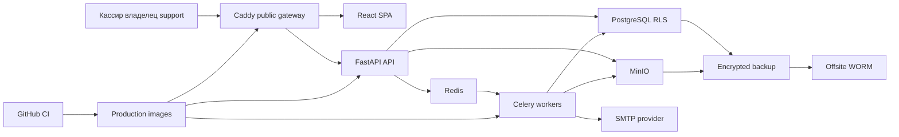

# Модель угроз Aurum Pharma для ограниченного веб-пилота

Дата: 2026-09-04
Статус: первоначальная repository-grounded модель угроз
Владелец документа: Архитектор безопасности Aurum Pharma

> Этот документ основан на анализе кода, миграций, тестов, ADR и production-
> конфигурации репозитория. Он не является результатом penetration test,
> юридическим заключением или разрешением на обработку реальных данных и денег.

## Executive summary

Aurum Pharma уже имеет сильную защиту бизнес-целостности: PostgreSQL RLS,
раздельные DB-роли, серверную авторизацию, MFA для привилегированных операций,
короткоживущие access-токены только в памяти, атомарные и идемпотентные продажи,
неизменяемые завершённые чеки и аудит. Для будущего публичного пилота наиболее
опасны четыре класса риска: захват учётной записи; ошибка в tenant/support-
границе; неоднозначный результат реального платежа или фискальной операции;
компрометация production-хоста, внутренних незашифрованных соединений или
резервных копий. Публичный пилот с реальными данными нельзя разрешать до
закрытия release blockers ниже и независимого pentest.

## Scope and assumptions

### In scope

- React/TypeScript SPA и браузерное хранение состояния:
  `frontend/src/`, `frontend/Caddyfile`.
- Публичный HTTP-контур, FastAPI middleware и API-домены:
  `backend/app/main.py`, `backend/app/middleware/`, `backend/app/domains/`.
- Аутентификация, сессии, MFA, роли, support-доступ и tenant/branch authorization:
  `backend/app/core/security.py`, `backend/app/core/deps.py`,
  `backend/app/domains/auth/`, `backend/app/domains/roles/`,
  `backend/app/domains/support_access/`, `backend/app/domains/platform_access/`.
- Касса, оплаты, возвраты, остатки, каталог, импорты и изображения:
  `backend/app/domains/pos/`, `backend/app/domains/inventory/`,
  `backend/app/domains/catalog/`, `backend/app/domains/customer_returns/`.
- PostgreSQL schema, RLS, триггеры и миграции: `backend/alembic/versions/`.
- Production Compose, Caddy, PostgreSQL, Redis, MinIO, Celery, мониторинг,
  backup/PITR/WORM и CI supply chain: `docker-compose.production.yml`,
  `infra/`, `.github/workflows/ci.yml`.

### Out of scope

- Полноценный Edge/offline writer, автономная работа сутки и native Windows-
  клиент: production-активация Edge намеренно выключена в
  `backend/app/core/config.py`; для них нужна отдельная модель угроз.
- Реальные банковские, QR и фискальные API: договоры и адаптеры ещё отсутствуют.
  В этой модели оцениваются требования к будущей границе, но не безопасность
  неизвестного провайдера.
- Безопасность ОС, дата-центра, DNS-регистратора, WAF/CDN и secret manager,
  которые ещё не выбраны или не представлены конфигурацией в репозитории.
- Юридическая допустимость обработки данных и фискализации; её gate находится в
  `docs/compliance/pilot-legal-gate.md`.
- Социальная инженерия сотрудников вне тех последствий, которые приложение
  способно ограничить технически.

### Подтверждённый контекст и assumptions

- Сейчас система разрабатывается локально и иногда доступна через Tailscale;
  будущий пилот будет публичным веб-сервисом для нескольких аптек.
- Пилот предполагает реальные остатки, продажи и сотрудников; персональные и
  рецептурные данные считаются чувствительными, даже если конкретный набор полей
  пилота ещё не утверждён.
- Кассир работает только в назначенной аптеке/филиале; владелец управляет только
  своими сотрудниками. Developer/Administrator используют отдельный глобальный
  контекст и ограниченную support session для tenant-доступа.
- Первый production-контур предполагается однохостовым: Caddy является
  единственной публичной точкой, остальные сервисы находятся во внутренних
  Docker networks (`docker-compose.production.yml`, `docs/adr/0008-production-perimeter.md`).
- Банки и фискальный провайдер не подключены. До их подписанного server-to-server
  подтверждения разрешены только синтетические тесты и ручная сверка тестовых
  операций; интерфейс Aurum не считается подтверждением движения денег.
- Полный offline POS не входит в веб-пилот. Краткий сетевой сбой должен
  восстанавливаться через idempotency/reconciliation, но не разрешать слепой
  повтор денежной команды.

### Открытые вопросы, меняющие оценку риска

1. Какой hosting/WAF/DDoS-провайдер, secret manager и регион хранения будут
   утверждены для production?
2. Сколько аптек, касс и одновременных пользователей входит в первый пилот и
   какие персональные/рецептурные поля реально будут собираться?
3. Какие гарантии, подписи, webhooks, idempotency и dispute-процессы предоставят
   банк, QR-оператор и фискальный провайдер?

## System model

### Primary components

| Компонент | Назначение | Evidence anchor |
|---|---|---|
| Browser SPA | Интерфейсы кассира, владельца и support; access-token хранится только в памяти, refresh-token остаётся в HttpOnly cookie | `frontend/src/stores/auth.ts`, `frontend/src/features/auth/storage.ts`, `frontend/src/lib/api.ts` |
| Caddy gateway | Единственная публичная точка, TLS, static SPA, `/api/*`, security headers, лимит тела запроса | `frontend/Caddyfile`, `docker-compose.production.yml` (`gateway`) |
| FastAPI backend | HTTP API, Pydantic-валидация, auth context, permissions, доменные транзакции | `backend/app/main.py`, `backend/app/core/deps.py`, `backend/app/domains/*/router.py` |
| PostgreSQL | Источник истины для tenant-данных, денег, остатков, ролей и аудита; RLS и DB-инварианты | `backend/app/core/db.py`, `backend/alembic/versions/0027_harden_rls_support_context.py`, `backend/alembic/versions/0069_enforce_finalized_sale_immutability.py` |
| Redis | MFA attempt budget, authorization cache, Celery broker/state | `backend/app/core/redis.py`, `backend/app/domains/auth/service.py`, `backend/app/tasks/` |
| MinIO | Импорты каталога, нормализованные изображения и документы/объекты | `backend/app/core/storage.py`, `backend/app/domains/catalog/router.py`, `infra/minio/aurum-app-policy.json` |
| Celery workers | Системные задачи, импорт каталога, mail outbox и billing transitions в отдельных процессах с точными allowlist секретов; выделенная DB-роль системного worker остаётся pilot blocker | `backend/app/tasks/`, `docker-compose.production.yml` (`celery-worker`, `catalog-worker`, `platform-mailer`, `billing-worker`), `docs/adr/0030-celery-process-boundaries.md` |
| Monitoring | Внутренние Prometheus metrics и recovery health | `backend/app/main.py` (`metrics`), `infra/prometheus/`, `docker-compose.production.yml` |
| Recovery plane | Logical backup, WAL/PITR, Restic, off-site WORM и restore drills | `infra/backup/`, `docker-compose.recovery.yml`, `docs/adr/0025-recovery-slo-and-evidence.md` |
| CI/build | Тесты, dependency audit, secret/image scanning и SBOM | `.github/workflows/ci.yml`, `backend/pyproject.toml`, `frontend/package.json` |

### Data flows and trust boundaries

- **TB-01 Internet -> Caddy gateway.** HTTPS переносит SPA, credentials и API
  payload. Caddy скрывает служебные маршруты, задаёт enforcing CSP/security
  headers и ограничивает request body до 16 MB. Общего rate limit в штатном
  Caddy нет; до пилота требуется внешний edge/WAF. Evidence:
  `frontend/Caddyfile`, `docs/adr/0008-production-perimeter.md`.
- **TB-02 Browser -> FastAPI API.** Same-origin `/api/v1`, bearer access-token и
  HttpOnly refresh cookie. CORS использует явные origins/methods/headers;
  refresh cookie имеет `Secure` вне development. Access-token не сохраняется в
  Web Storage. Evidence: `frontend/src/lib/api.ts`,
  `frontend/src/features/auth/storage.ts`, `backend/app/main.py`,
  `backend/app/domains/auth/router.py` (`_set_refresh_cookie`).
- **TB-03 FastAPI -> PostgreSQL.** Обычные tenant-запросы идут через
  `aurum_app`; request transaction получает `app.user_id` и `app.tenant_id`.
  Ограниченный support lookup использует отдельный pool, а tenant business query
  остаётся RLS-scoped. Канал внутри production network пока без TLS. Evidence:
  `backend/app/core/deps.py` (`get_db`, `_seed_request_db_context`,
  `_resolve_support_access_context`),
  `backend/alembic/versions/0027_harden_rls_support_context.py`.
- **TB-04 API/workers -> Redis.** Передаются auth budgets, cache и job messages;
  Redis закрыт internal network, требует отдельный пароль и запрещает опасные
  команды, но transport TLS пока отсутствует. Evidence:
  `docker-compose.production.yml` (`redis`), `backend/app/core/config.py`.
- **TB-05 API/workers -> MinIO.** Загружаются tenant-scoped объекты; приложение
  получает bucket-scoped account, а изображения проверяются, декодируются,
  очищаются от metadata и перекодируются. Внутренний transport использует HTTP.
  Evidence: `backend/app/domains/catalog/image_processing.py`,
  `backend/app/domains/catalog/router.py`, `infra/minio/aurum-app-policy.json`,
  `docker-compose.production.yml` (`MINIO_SECURE=false`).
- **TB-06 API -> Celery workers -> external SMTP.** Job payload проходит через
  Redis; mailer имеет отдельные DB credentials и единственный worker с внешним
  egress. Email outbox шифруется отдельным keyring. Evidence:
  `docker-compose.production.yml` (`platform-mailer`),
  `backend/app/tasks/`, `backend/app/core/config.py`.
- **TB-07 Production host -> recovery storage/host.** Backup шифруется Restic,
  WAL и точные object versions экспортируются в WORM; signed checkpoint и
  read-only restore identity ограничивают подмену. Реальный внешний bucket,
  независимый recovery-host и измеренные RPO/RTO ещё не подтверждены. Evidence:
  `infra/backup/`, `docs/adr/0023-pitr-and-offsite-worm.md`,
  `docs/adr/0026-trusted-worm-checkpoints.md`.
- **TB-08 Git/CI -> production images.** Lock-файлы, pinned actions/images,
  dependency audits, secret/image scan и CycloneDX SBOM снижают supply-chain
  риск. Production images пока не публикуются и не проверяются по подписанному
  digest. Evidence: `.github/workflows/ci.yml`, `docs/security-release-plan.md`.

#### Diagram

## Assets and security objectives

| Asset | Why it matters | Security objective |
|---|---|---|
| Tenant и branch isolation | Утечка между аптеками нарушает конфиденциальность и доверие к SaaS | C/I |
| Учётные записи, MFA, sessions и recovery codes | Захват владельца или support даёт доступ к людям, деньгам и ролям | C/I/A |
| Продажи, оплаты, возвраты и смены | Ошибка создаёт прямой денежный ущерб и неверную отчётность | I/A |
| Остатки, партии, FEFO и сроки годности | Подмена может привести к продаже отсутствующего или небезопасного лекарства | I/A |
| Персональные, рецептурные и контактные данные | Утечка причиняет вред человеку и создаёт регуляторный риск | C/I |
| Роли, ownership и support grants | Определяют границу полномочий и возможность cross-tenant доступа | I |
| Audit log, receipt snapshots и reconciliation evidence | Нужны для расследования и доказательства финансовой истории | I/A |
| JWT/MFA/email keys, DB/Redis/MinIO/SMTP credentials | Компрометация открывает системный или массовый доступ | C/I |
| Production images, migrations и CI identity | Подмена выпуска позволяет внедрить код до всех runtime-контролей | I |
| Backup, WAL, WORM checkpoints и restore keys | Последняя граница после удаления, ransomware или порчи БД | C/I/A |
| Доступность POS/API/DB/Redis | Недоступность останавливает продажи веб-пилота | A |

## Attacker model

### Capabilities

- Неаутентифицированный удалённый пользователь может отправлять произвольные
  HTTPS-запросы к Caddy, auth endpoints, `/healthz` и публичной SPA.
- Пользователь одной аптеки может менять клиентские запросы, UUID, branch/tenant
  параметры, payload, порядок и конкурентность вызовов, не полагаясь на UI.
- Злоумышленник может получить пароль кассира/владельца через phishing,
  credential stuffing или доступ к незаблокированному рабочему месту.
- Вредоносный сотрудник имеет действительную учётную запись и пытается расширить
  роль, увидеть другой филиал, изменить остаток, скрыть возврат или экспортировать
  данные.
- Компрометированный браузер, dependency или injected script может действовать в
  контексте текущего пользователя и читать access-token из памяти процесса.
- После компрометации одного контейнера или production-хоста атакующий может
  пытаться прослушивать internal network, читать mounted secrets, Redis, MinIO и
  удалять локальные backup.
- Атакующий может загружать специально сформированные CSV/XLSX/PNG/JPEG в рамках
  доступного endpoint и многократно вызывать ресурсоёмкие API.

### Non-capabilities

- Изначально у внешнего атакующего нет shell/root-доступа к production host,
  secret manager, PostgreSQL, Redis, MinIO, CI signing identity или WORM account.
- Не предполагается взлом TLS, bcrypt, HMAC, JWT или TOTP криптографии напрямую.
- Реальных банковских/fiscal credentials и webhooks пока нет; компрометация
  конкретного провайдера не может быть оценена до получения контракта.
- Production Edge writer, offline refund и автономная 24-часовая касса не
  включены, поэтому их device-key/rollback угрозы не повышают риск веб-пилота.
- Физический доступ к серверу и сговор нескольких доверенных владельцев допуска
  рассматриваются операционным риском, если не приводят к runtime abuse path.

## Entry points and attack surfaces

| Surface | How reached | Trust boundary | Notes | Evidence |
|---|---|---|---|---|
| Login, refresh, logout, MFA, recovery, activation | Public `/api/v1/auth/*` and invitation routes | TB-01, TB-02 | Account enumeration, brute force, token/session replay | `backend/app/domains/auth/router.py`, `backend/app/domains/platform_accounts/router.py` |
| Tenant business APIs | Authenticated `/api/v1/*` | TB-02, TB-03 | UUID tampering, missing permission/scope, mass assignment | `backend/app/main.py`, `backend/app/core/deps.py` |
| Support access | Platform account plus scoped support session header | TB-02, TB-03 | Highest cross-tenant impact if scope binding fails | `frontend/src/lib/api.ts`, `backend/app/domains/support_access/`, `backend/app/core/deps.py` |
| POS/payment/refund/shift endpoints | Authenticated cashier/manager API | TB-02, TB-03 | Money replay, race, uncertain terminal result, stock integrity | `backend/app/domains/pos/router.py`, `backend/app/domains/pos/service.py` |
| Catalog image and CSV/XLSX import | Multipart upload and background processing | TB-01, TB-02, TB-05, TB-06 | Parser exploit, archive bomb, storage/worker exhaustion | `backend/app/domains/catalog/router.py`, `backend/app/domains/catalog/import_parser.py`, `backend/app/domains/catalog/image_processing.py` |
| Reports, exports, receipts and audit | Authenticated reads/downloads | TB-02, TB-03 | Sensitive export or cached response exposure | `backend/app/domains/pos/router.py`, `backend/app/domains/audit/router.py` |
| Health and metrics | `/healthz`; token-protected `/metrics` outside development | TB-01 | Service enumeration and operational data exposure | `backend/app/main.py`, `frontend/Caddyfile` |
| Redis/Celery queues | Internal service network | TB-04, TB-06 | Forged jobs, auth guard outage, queue exhaustion | `backend/app/tasks/`, `docker-compose.production.yml` |
| MinIO object API | Internal application account | TB-05 | Cross-tenant object naming, overwrite, data loss | `backend/app/core/storage.py`, `infra/minio/aurum-app-policy.json` |
| Deployment, migration and CI | Git push/PR, GitHub Actions, maintenance profiles | TB-08 | Malicious dependency/action/image or privileged migration | `.github/workflows/ci.yml`, `docker-compose.production.yml` |
| Backup and restore | Scheduled scripts and off-site object storage | TB-07 | Deletion, rollback, poisoned restore, leaked archive | `infra/backup/`, `docker-compose.recovery.yml` |

## Top abuse paths

1. **Захват владельца:** attacker повторно использует утекший пароль -> проходит
   публичный login -> получает tenant session -> создаёт/переназначает сотрудника
   или выполняет разрешённые владельцу операции -> меняет доступ и бизнес-данные.
2. **Cross-tenant IDOR/RLS bypass:** пользователь аптеки A подставляет UUID
   филиала/чека аптеки B -> маршрут забывает branch/resource gate -> ошибочная
   DB policy или privileged pool возвращает/изменяет чужую строку -> массовая
   утечка либо порча tenant-данных.
3. **Злоупотребление support:** захваченный support account проходит MFA или
   крадёт активную session -> создаёт scoped support access с широкой capability
   -> просматривает или меняет данные клиента -> пытается скрыться в объёме
   легитимного support-трафика.
4. **Повтор неизвестного платежа:** WAN/terminal timeout происходит после
   списания -> клиент не получает ответ -> UI/интеграция создаёт новую operation
   вместо recovery прежней -> покупатель платит дважды или продажа/остаток не
   соответствуют банковской операции.
5. **Двойной возврат или поддельное evidence:** сотрудник повторно использует
   номер терминального документа либо запускает concurrent refund -> Aurum
   фиксирует лишний возврат -> деньги и склад расходятся с исходным чеком.
6. **Гонка остатков:** две кассы одновременно продают последнюю партию или
   атакующий меняет batch ID -> без блокировки/DB constraint появляется
   отрицательный остаток или обход FEFO/expiry -> неверная или опасная продажа.
7. **Вредоносный импорт:** пользователь загружает oversized/decompression-bomb
   XLSX/изображение -> parser или worker потребляет CPU/RAM/disk либо использует
   уязвимость библиотеки -> деградация сервиса или выполнение кода в контейнере.
8. **Публичный DoS:** бот распределённо вызывает login, search, reports, imports
   и health -> исчерпывает workers, DB pool или Redis -> кассиры всех аптек не
   могут продавать, хотя логика приложения корректна.
9. **Перехват internal traffic:** после foothold в одном контейнере атакующий
   слушает незашифрованные PostgreSQL/Redis/MinIO соединения -> получает данные,
   job payload или credentials/session state -> расширяет компрометацию.
10. **Supply-chain release compromise:** dependency/CI identity или registry tag
    подменён -> неподписанный образ разворачивается как официальный -> код крадёт
    секреты и tenant-данные, обходя прикладные контроли.
11. **Ransomware и ложное восстановление:** production host и локальные backup
    удалены -> внешний WORM не развернут или checkpoint/keys недоступны -> сервис
    не восстанавливается либо оператор выбирает подменённую/старую версию.
12. **Privacy leakage:** чувствительные поля попадают в log, audit metadata,
    export, browser draft или сторонний error/analytics сервис -> сотрудник,
    оператор или скрипт получает данные за пределами business need.

## Threat model table

| Threat ID | Threat source | Prerequisites | Threat action | Impact | Impacted assets | Existing controls (evidence) | Gaps | Recommended mitigations | Detection ideas | Likelihood | Impact severity | Priority |
|---|---|---|---|---|---|---|---|---|---|---|---|---|
| TM-001 | Internet attacker, phisher | Известен email/пароль или доступно повторение паролей | Credential stuffing, session theft, захват owner/cashier account | Несанкционированные продажи, возвраты, экспорт и управление сотрудниками | Accounts, sessions, roles, money, tenant data | bcrypt; DB login-attempt ledger; Redis MFA attempt budget; session revocation; support MFA (`backend/app/domains/auth/service.py`, `backend/app/core/deps.py`) | MFA не подтверждена как обязательная для владельца/кассира; нет внешнего bot/WAF rate limit | Обязать MFA владельцу и опасным owner-действиям; breached-password check; WAF rate limit по account/device/IP; risk alerts и безопасный recovery | Алерты по spray, новым устройствам, частым refresh reuse, изменениям ролей после нового входа | high | high | high |
| TM-002 | Malicious tenant user, coding defect | Маршрут или repository принимает чужой UUID; ошибка RLS/pool | Обход permission/branch scope или tenant RLS | Cross-tenant чтение/изменение данных, системный инцидент | Tenant data, PII, money, inventory | `aurum_app` NOBYPASSRLS; request GUC; branch permission registry; isolation tests (`backend/app/core/deps.py`, migration `0027`, `backend/tests/isolation/`) | Любая новая таблица/route может нарушить контракт; support pool остаётся высокорисковым | CI gate для всех новых tenant tables/routes; FORCE RLS где допустимо; composite tenant FKs; негативные IDOR-тесты; запрет raw support repository access | Алерт на tenant mismatch, RLS error bursts, access к нескольким tenant одним sid без support session | medium | high | high |
| TM-003 | Compromised/insider support account | Действующий platform grant, MFA/session или ошибка support binding | Создание чрезмерной support session и массовый доступ к аптеке | Массовая утечка, изменение ролей/данных, репутационный ущерб | All tenant assets, audit | MFA and recent step-up; reason, expiry, capabilities; session lineage; business query remains RLS-scoped (`backend/app/core/deps.py`, `backend/app/domains/support_access/`) | Нет доказанного dual approval/break-glass review и внешнего SIEM; один support account остаётся сильным субъектом | JIT support grants; dual approval для write/high-risk scopes; короткий TTL; customer-visible access log; quarterly access review; hardware-backed MFA | Alert на новые write support sessions, unusual tenant count/export volume, off-hours access | medium | high | high |
| TM-004 | Network fault, malicious cashier, future provider | Реальный bank/QR/fiscal adapter и неизвестный результат | Повтор денежной команды или ложное ручное подтверждение | Двойное списание, незавершённая продажа, расхождение денег/остатка | Payments, sales, receipts, stock | Tenant-scoped operation IDs; advisory locks; immutable attempts; reconciliation; atomic checkout/outbox (`backend/app/domains/pos/service.py`, migrations `0081`, `0122`, POS concurrency/idempotency tests) | Provider contracts/signatures/webhooks отсутствуют; пользовательское evidence не доказывает движение денег | Не выпускать real-money flow до signed provider result; provider idempotency key; webhook signature/replay guard; explicit unknown state; no blind retry; end-of-shift reconciliation | Alert на unresolved attempts, duplicate references, mismatch provider total vs Aurum, stale reconciliation | medium after integration | high | high |
| TM-005 | Malicious cashier, concurrency, client tampering | Одновременные продажи/возвраты или изменённые item/batch payload | Oversell, обход FEFO/expiry, double refund | Финансовый и фармацевтический ущерб | Inventory, batches, sales, customer safety | `SELECT FOR UPDATE`, negative-stock trigger, completion-time expiry check, immutable completed sale, bounded refunds (`backend/app/domains/pos/`, migration `0069`, `backend/tests/domains/pos/test_concurrency.py`) | Нужна production load/fault проверка и мониторинг инвариантов; физический остаток может расходиться | Load tests на pilot concurrency; periodic invariant queries; controlled stock adjustment; manager approval and audit; expired/recall fail-closed | Negative/near-negative stock, repeated conflicts, FEFO deviations, refund ratio anomaly | low | high | medium |
| TM-006 | Authenticated uploader | Permission на импорт/фото | Parser bomb, malformed archive/image, storage flooding | Worker/API DoS, disk exhaustion, возможный parser RCE | Availability, MinIO, worker compute | Caddy 16 MB limit; per-feature limits; Pillow verify/decompression guard/re-encode; XLSX archive validation; container limits (`frontend/Caddyfile`, catalog importer/image processing, production Compose) | Нет отдельного malware scanner/quarantine; лимиты tenant usage и job concurrency не доказаны | Quarantine before processing; strict ZIP entry/ratio/XML limits; tenant quotas; per-user import rate; pinned patched parsers; run parser worker without network/write privileges | Import failure/latency, decompression ratio, memory kills, object growth by tenant | medium | medium | medium |
| TM-007 | XSS, compromised frontend dependency | Script исполняется в SPA origin | Читает access-token из памяти и выполняет API actions от имени пользователя | Session abuse и утечка видимых данных | Access token, tenant data, user actions | HttpOnly refresh cookie; access-token not persisted; enforcing gateway CSP; no arbitrary external script origins (`frontend/src/features/auth/storage.ts`, `frontend/Caddyfile`) | `style-src 'unsafe-inline'`; нет независимого DAST/CSP reporting; compromised first-party bundle остаётся trusted | CSP report endpoint; Trusted Types feasibility review; dependency review/SRI where applicable; short token TTL; re-auth/MFA for dangerous actions; external DAST | CSP violations, impossible navigation/action sequences, high-risk action after new device | medium | high | high |
| TM-008 | Internet botnet | Public DNS/HTTPS | Resource exhaustion через auth/search/report/import/API concurrency | Все кассы теряют доступность | POS/API/DB/Redis availability | Internal networks; container CPU/memory/pid limits; auth-specific guards; health/Prometheus (`docker-compose.production.yml`, auth service) | Нет общего trusted edge rate limit/DDoS protection; single host is a failure domain | Managed DDoS/WAF; endpoint budgets; queue/backpressure; DB statement timeouts/pool limits; per-tenant quotas; tested degraded mode and capacity target | p95/p99, 429/5xx, pool saturation, Redis latency, worker queue, checkout success rate | high | high | high |
| TM-009 | Container/host intruder, network adversary | Foothold inside Docker host/network | Sniffing or modification of DB/Redis/MinIO traffic | Secret/data theft, forged jobs/objects, lateral movement | Credentials, PII, money, object data | Services not published; internal networks; Redis ACL; least-privilege DB/MinIO accounts (`docker-compose.production.yml`) | PostgreSQL, Redis and MinIO internal TLS explicitly incomplete | Mutual/authenticated TLS with certificate validation; separate network policies; rotate credentials after deployment; prevent Docker socket exposure | Unexpected connections, cert failures, DB/Redis client origin anomalies, object checksum mismatch | medium | high | high |
| TM-010 | CI/dependency/registry attacker | Write access to source/workflow/dependency or mutable deployment reference | Ships malicious image/migration | Full application and data compromise | Images, schema, secrets, all tenant assets | Locked dependencies; pinned actions/base image digests; audits; Trivy secret/image scan; SBOM (`.github/workflows/ci.yml`) | Release images not signed/verified by digest; no documented protected production promotion identity | Protected environments and CODEOWNERS; OIDC Cosign signing; deploy exact digest; provenance attestation; migration approval; reproducible build evidence | Signature/provenance verification failure, unexpected digest, workflow permission change | medium | high | high |
| TM-011 | Ransomware, malicious operator, host failure | Production host or local credentials compromised | Deletes/corrupts live data and reachable backups; poisons restore choice | Long outage, loss of financial/audit history | DB, objects, audit, backup, availability | Encrypted Restic; WAL/PITR; append-only WORM design; signed exact-version checkpoint; restore scripts (`infra/backup/`, ADR-0023/0025/0026) | External WORM/recovery host and independent keys not deployed; RPO/RTO not measured at pilot volume | Separate account/region/host; offline signing key; immutable retention; scheduled end-to-end restore; documented key recovery; measured and approved RPO/RTO | Backup freshness/free space, failed export/drill, checkpoint age, restore duration, checksum errors | medium | high | high |
| TM-012 | Developer error, insider, third-party telemetry | Sensitive field reaches logs/audit/export/browser cache | Reads or forwards data beyond least privilege | Privacy breach and regulatory exposure | PII, prescriptions, receipts, prices | Structured logging; audit redaction; receipt snapshot redaction; access permissions (`backend/app/core/logging.py`, migration `0026`, migration `0076`) | Full log allowlist/production sink review and third-party data-flow not proven; POS drafts use localStorage | Field-level data inventory; automated log assertions; no sensitive analytics; encrypt device storage in future native app; retention/deletion policy; export watermark/audit | Canary values in staging logs, DLP scans, unusual export/read volume, audit redaction failures | medium | high | high |

## Criticality calibration

- **Critical:** реалистичный pre-auth или low-privilege путь к массовому
  cross-tenant доступу, выполнению кода на production, компрометации signing/root
  secrets либо необратимому изменению денег/остатков без обнаружения. Примеры:
  подтверждённый RLS bypass всех аптек; RCE через публичный upload; обход
  подписи provider webhook с массовым созданием платежей.
- **High:** захват одного владельца/support account, двойное движение реальных
  денег, компрометация внутреннего transport или outage всех касс. Примеры:
  credential stuffing владельца без MFA; повтор unknown payment; DoS single-host
  public gateway.
- **Medium:** ограниченная одной аптекой/ролью порча, обнаруживаемая гонка или
  временная деградация с рабочим восстановлением. Примеры: parser DoS в рамках
  quota; oversell, остановленный DB-инвариантом; утечка низкочувствительной
  operational metadata.
- **Low:** шумная атака без чувствительных данных, привилегий или устойчивого
  эффекта. Примеры: раскрытие общего health status; отклонённый чужой UUID с
  одинаковым 404; единичный malformed request без заметной нагрузки.

Оценка зависит прежде всего от обязательности MFA для owner, реального объёма
пилота, состава персональных данных, выбранного WAF/hosting и контрактов
bank/fiscal provider. Подтверждённая эксплуатация любого cross-tenant или
money-integrity дефекта повышает приоритет до critical независимо от таблицы.

## Release blockers

Следующие пункты блокируют ограниченный публичный пилот с реальными данными,
продажами или деньгами:

1. Развернуть production-like staging через `docker-compose.production.yml`, а
   не публиковать dev/demo Compose или Vite.
2. Выдать независимые production secrets через внешний secret manager,
   отрепетировать MFA/email/JWT/DB key rotation и emergency revoke.
3. Включить TLS с проверкой сертификатов для PostgreSQL, Redis и MinIO внутри
   production-контура.
4. Поставить перед Caddy доверенный WAF/DDoS/rate-limit слой, зафиксировать
   trusted proxy CIDR и проверить spoofing forwarded headers.
5. Развернуть внешний WORM bucket и независимый recovery-host, отделить ключи,
   выполнить минимум три end-to-end restore drills на объёме пилота и измерить
   RPO/RTO.
6. Публиковать production images по digest, подписывать через OIDC/Cosign и
   проверять подпись/provenance перед deployment.
7. Подключить внешний alert delivery, проверить log allowlist/redaction и
   мониторинг auth, cross-tenant, reconciliation, backup и capacity событий.
8. Провести независимый pentest после закрытия инфраструктурных пунктов;
   исправить или письменно принять все critical/high findings. Эта модель угроз
   не заменяет pentest.
9. До реальных card/QR/fiscal операций получить provider contracts и реализовать
   подписанное server-to-server подтверждение, replay protection, unknown-state
   reconciliation и тесты отказов. Ручное нажатие сотрудника не подтверждает
   движение денег.
10. Закрыть `docs/compliance/pilot-legal-gate.md` и подписать pilot release
    decision. До этого допустим только `LOCAL_DEMO`, а `WEB_UAT` — лишь после
    отдельной privacy/security приёмки без реальных покупателей, рецептов и денег.

## Focus paths for security review

| Path | Why it matters | Related Threat IDs |
|---|---|---|
| `backend/app/core/deps.py` | Выбор DB pool, RLS context, current identity, permission и support-session boundary | TM-002, TM-003 |
| `backend/app/core/security.py` | JWT, hashing, refresh derivation, MFA and recovery cryptography | TM-001, TM-003 |
| `backend/app/domains/auth/` | Login, MFA, refresh rotation, session revoke и abuse guards | TM-001 |
| `backend/app/domains/support_access/` | Самая чувствительная cross-tenant workflow | TM-002, TM-003 |
| `backend/app/domains/roles/` | Делегирование прав, immutable role versions и anti-escalation | TM-001, TM-002, TM-003 |
| `backend/app/domains/pos/` | Атомарность денег/остатков, idempotency, reconciliation, refunds | TM-004, TM-005 |
| `backend/app/domains/catalog/` | Multipart, image decoder, CSV/XLSX parser и object paths | TM-006, TM-012 |
| `backend/alembic/versions/0027_harden_rls_support_context.py` | DB-level tenant/support isolation contract | TM-002, TM-003 |
| `backend/alembic/versions/0069_enforce_finalized_sale_immutability.py` | DB-level financial lifecycle and immutable sale history | TM-004, TM-005 |
| `backend/alembic/versions/0026_harden_audit_log.py` | Append-only audit and sensitive field redaction | TM-003, TM-012 |
| `frontend/src/lib/api.ts` | Token attachment, refresh retry and allowlisted support context header | TM-001, TM-002, TM-007 |
| `frontend/src/features/auth/storage.ts` | Proof that sensitive tokens are not persisted in Web Storage | TM-001, TM-007 |
| `frontend/Caddyfile` | Public routes, CSP, headers, body limits and reverse proxy behavior | TM-007, TM-008 |
| `docker-compose.production.yml` | Network exposure, secrets, service privileges and internal transport | TM-008, TM-009, TM-011 |
| `infra/backup/` | Integrity and recoverability after total host compromise | TM-011 |
| `.github/workflows/ci.yml` | Supply-chain controls, scans, SBOM and release artifact path | TM-010 |

## Quality check

- [x] Отделены runtime, CI/build, recovery и будущие external integrations.
- [x] Покрыты публичный ingress, auth, tenant/support boundary, POS, uploads,
  queues, DB/cache/object storage, monitoring, deployment и backup entry points.
- [x] Каждая обнаруженная trust boundary представлена минимум в одной угрозе.
- [x] Existing controls отделены от gaps и будущих рекомендаций.
- [x] Указаны attacker capabilities и non-capabilities без завышения доступа.
- [x] Контекст локальной разработки, Tailscale и будущего публичного пилота
  отражён; bank/fiscal и полноценный offline явно вынесены за текущий scope.
- [x] Release blockers не объявлены выполненными без внешних доказательств.
- [x] Pentest не заявлен выполненным и остаётся обязательным независимым gate.
